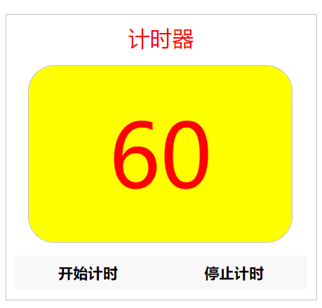
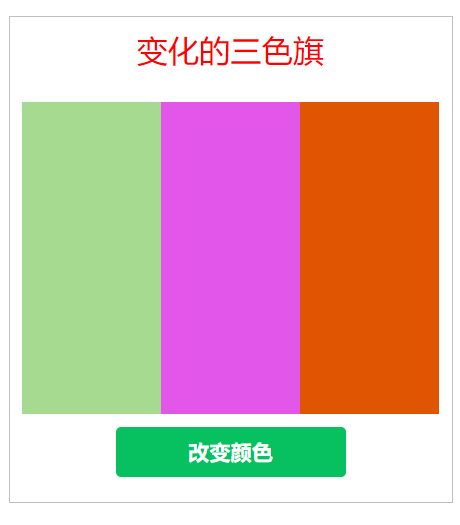
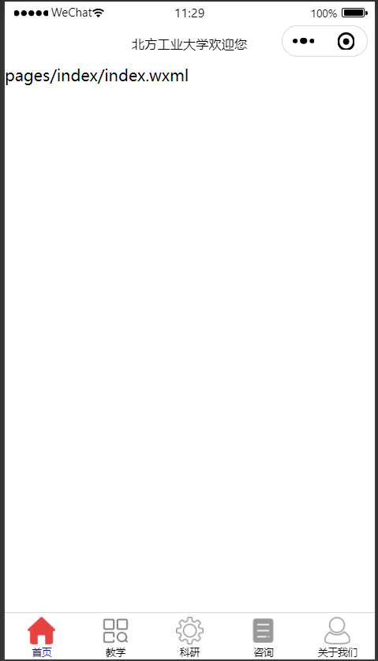

[TOC]

# 微信小程序

## 第1章 初识微信小程序

### 1.1 注册小程序账号

小程序官网：https://mp.weixin.qq.com/cgi-bin/wx

邮箱：

【开发】->【开发管理】->【开发设置】->【APPID】： 

【首页】->【小程序开发与管理】->【普通小程序开发者工具】->【微信开发者工具】->【稳定版Windows64】

<div STYLE="page-break-after: always;"></div>

### 1.2 第一个微信小程序

创建小程序：填写【目录（桌面）】、【APPID】、【开发模式：小程序】、【不使用云服务】、【JavaScript基础模板】

开发者工具：

1. 模拟器
2. 编辑器
3. 调试器
4. 资源管理器
5. 预览/真机调试

```html
<!--index.wxml-->
<view>Hello Wechat!</view>
```

<div STYLE="page-break-after: always;"></div>

### 1.3 字体样式设置

设计一个小程序，分别利用style和class属性设置字体样式，在`index.wxss`中定义样式类。所有的文字都包含在一个边框内，边框内上方有标题文字，边框和标题样例利用class属性来设置，在`app.wxss`中定义样式类。


1. 添加两段文本

```html
<!--index.wxml-->

<view>
  <view>利用style设置字体样式：</view>
  <view>字体：sans-serif，30像素</view>
</view>
===========================
<view>
  <view>利用class设置字体样式：</view>
  <view>字体：cursive、25像素、倾斜、加粗</view>
</view>
```

2. 添加style属性

```html
<!--index.wxml-->

<view style="font-family: sans-serif; font-size: 30px;">
  <view>利用style设置字体样式：</view>
  <view>字体：sans-serif，30像素</view>
</view>
===========================
<view>
  <view>利用class设置字体样式：</view>
  <view>字体：cursive、25像素、倾斜、加粗</view>
</view>
```

3. 添加class类

```css
/**index.wxss**/

.fontStyle {
  font-family: cursive;
  font-size: 25px;
  font-style: italic;
  font-weight: bold;
}
```

```html
<!--index.wxml-->

<view style="font-family: sans-serif; font-size: 30px;">
  <view>利用style设置字体样式：</view>
  <view>字体：sans-serif，30像素</view>
</view>
===========================
<view class="fontStyle">
  <view>利用class设置字体样式：</view>
  <view>字体：cursive、25像素、倾斜、加粗</view>
</view>
```

4. 添加边框

```css
/**app.wxss**/

.box {
  border: 1px solid silver;
}
```

```html
<!--index.wxml-->

<view class="box">
  <view style="font-family: sans-serif; font-size: 30px;">
    <view>利用style设置字体样式：</view>
    <view>字体：sans-serif，30像素</view>
  </view>
  ===========================
  <view class="fontStyle">
    <view>利用class设置字体样式：</view>
    <view>字体：cursive、25像素、倾斜、加粗</view>
  </view>
</view>
```

5. 设置边框相对边距

```css
/**app.wxss**/

.box {
  border: 1px solid silver;
  margin: 20rpx;
  padding: 20rpx;
}
```

6. 添加标题

```css
/**app.wxss**/

.box {
  border: 1px solid silver;
  margin: 20rpx;
  padding: 20rpx;
}

.title {
  font-size: 25px;
  text-align: center;
  margin-bottom: 15px;
  color: red;
}
```

```html
<!--index.wxml-->

<view class="box">
  <view class="title">字体样式设置</view>
  <view style="font-family: sans-serif; font-size: 30px;">
    <view>利用style设置字体样式：</view>
    <view>字体：sans-serif，30像素</view>
  </view>
  ===========================
  <view class="fontStyle">
    <view>利用class设置字体样式：</view>
    <view>字体：cursive、25像素、倾斜、加粗</view>
  </view>
</view>
```

| 属性        | 含义     | 说明                                              |
| ----------- | -------- | ------------------------------------------------- |
| font-family | 字体类型 | Serif, Sans-serif, Monospace, Cursive, Fantasy    |
| font-size   | 字体大小 | 5px/rpx/cm, large, small, medium, larger, smaller |
| font-style  | 字体倾斜 | italic, normal, oblique                           |
| font-weight | 字体加粗 | bold, bolder, lighter                             |

view组件支持使用style和class属性来设置组件的样式。

利用style可直接在WXML文件中设置，利用class需要先在WXSS文件中定义样式类。

静态样式一眼使用class设置，动态样式一般使用style设置，这样可以提高渲染速度。


在`app.wxss`中定义的样式类属于全局样式类，可以在项目的任何文件中使用。

在`index.wxss`中定义的样式类一般只在`index.wxml`中使用。

<div STYLE="page-break-after: always;"></div>

### 1.4 文本样式设置

创建一个微信小程序，利用class属性设置文本样式，包括：文本的颜色、字符间距、对齐文本、装饰文本、对文本进行缩进，等等。


1. 添加两段文本

```html
<!--index.wxml-->

<view class="box">
  <view class="title">文本样式设置</view>
  <view class="textStyle01">
    文本属性可定义文本的外观。通过设置文本属性，您可以改变文本的颜色、字符间距、对齐文本、装饰文本、对文本进行缩进，等等。
  </view>
  ===========================
  <view class="textStyle02">
    North China University of Technology (NCUT) is located in the western part of Beijing, which is a municipal university founded in 1946.
  </view>
</view>
```

2. 重复利用1.3章节中的`app.wxss`样式

```css
/**app.wxss**/

.box {
  border: 1px solid silver;
  margin: 20rpx;
  padding: 20rpx;
}

.title {
  font-size: 25px;
  text-align: center;
  margin-bottom: 15px;
  color: red;
}
```

3. 设置样式

```css
/**index.wxss**/

.textStyle01 {
  color: red;
  letter-spacing: 10px;
  text-align: left;
  text-indent: 50px;
  text-decoration: underline;
  text-decoration-color: #00f;
  line-height: 30px;
  white-space: normal;
}

.textStyle02 {
  text-align: justify;
  word-spacing: 20px;
  text-transform: uppercase;
  white-space: pre-wrap;
}
```

| 属性                  | 含义                       |
| --------------------- | -------------------------- |
| color                 | 字体颜色                   |
| text-align            | 文本对齐方式               |
| text-indent           | 首行缩进                   |
| letter-spacing        | 字母之间的距离             |
| word-spacing          | 单词间距，以空格来区分单词 |
| white-space           | 文档中的空白处             |
| text-decoration       | 文本修饰样式               |
| text-decoration-color | 文本修饰颜色               |

<div STYLE="page-break-after: always;"></div>

### 1.5 图片与声音

设计一个小程序，小程序运行后显示一张猫图，点击猫图后会发出猫叫的声音。


1. 添加标题和样式

```html
<!--index.wxml-->

<view class="box">
  <view class="title">图片和声音</view>
</view>
```

```css
/**app.wxss**/

.box {
  border: 1px solid silver;
  margin: 20rpx;
  padding: 20rpx;
}

.title {
  font-size: 25px;
  text-align: center;
  margin-bottom: 15px;
  color: red;
}
```

2. 添加图片路径，绑定点击事件

```html
<!--index.wxml-->

<view class="box">
  <view class="title">图片和声音</view>
  <view>
    <image src="{{imgSrc}}" bindtap="tapCat"></image>
  </view>
</view>
```

3. 设置图片路径

```js
// index.js

Page({
  data: {
    imgSrc: "/images/kitty.png"
  },
  // 事件处理函数
})
```

> 如图片显示超出边框，更换机型。

4. 实现tap事件

```js
// index.js

Page({
	data: {
		imgSrc: "/images/kitty.png"
	},
	// 事件处理函数
	tapCat: function () {
		let audio = wx.createInnerAudioContext();
		audio.src = "audios/meow.mp3";
		audio.play();
	}
})
```

images组件：支持JPG、PNG、SVG格式，用`src`属性指定图片的路径。

音频：首先利用API函数`wv.createInnerAudioContext()`创建音频上下文，然后设置该上下文的`src`，并利用`play()`函数播放音频。

数据绑定：WXML文件中的动态数据通过`{{}}`符号与JS文件中的数据进行绑定，这样JS中的数据就可以传给WXML文件。这种传递是单向的。

事件绑定：在WXML文件组件标签内利用`bind...=函数名`绑定组件事件与函数，并在JS文件中定义该事件函数。

<div STYLE="page-break-after: always;"></div>

## 第2章 盒模型与页面布局

### 2.1 盒模型

设计一个小程序，利用盒模型的相关属性实现不同的布局模式。


1. 添加三段文本

```html
<!--index.wxml-->

<view class="box">
	<view class="title">盒模型</view>
	<view class="boxModel01">
		.boxModel01 { width: 80%; height: 120px; background-color: yellow; border: 3px dashed #FF0000; padding: 20px; margin: 20px; }
	</view>
	<view class="boxModel02">
		.boxModel02 { width: 80%; height: 120px; border: 5px solid rgb(0, 255, 0); padding-top: 20px; margin-bottom: 20px; }
	</view>
	<view class="boxModel03">
		.boxModel03 { width: 80%; height: 120px; border: 5px dotted rgba(0, 0, 255, 0.3); padding-left: 20px; margin: 0 20px; }
	</view>
</view>
```

2. 设置盒模型样式

```css
/**index.wxss**/

.boxModel01 {
	width: 80%;
	height: 120px;
	background-color: yellow;
	border: 3px dashed #FF0000;
	padding: 20px;
	margin: 20px;
}

.boxModel02 {
	width: 80%;
	height: 120px;
	border: 5px solid rgb(0, 255, 0);
	padding-top: 20px;
	margin-bottom: 20px;
}

.boxModel03 {
  width: 80%;
  height: 120px;
  border: 5px dotted rgba(0, 0, 255, 0.3);
  padding-left: 20px;
  margin: 0 20px; /* 外上下边距为0，左右边距为20px */
}
```

所有WXML元素都可以看作盒子，在WXSS中，box model这一术语是用来设计和布局时使用。盒模型本质上是一个盒子，封装周围的WXML元素，它包括：边距、边框、填充和实际内容。


边框样式：`border-style`属性用来定义边框的样式。

| 边框样式 | 说明                                         |
| -------- | -------------------------------------------- |
| none     | 默认无边框                                   |
| dotted   | 定义一个点线边框                             |
| dashed   | 定义一个虚线边框                             |
| solid    | 定义实现边框                                 |
| double   | 定义两个边框                                 |
| groove   | 定义3D沟槽边框，效果取决于边框的颜色值       |
| ridge    | 定义3D脊边框，效果取决于边框的颜色值         |
| inset    | 定义一个3D的嵌入边框，效果取决于边框的颜色值 |
| outset   | 定义一个3D突出边框，效果取决于边框的颜色值   |

边框宽度：`border-width`属性用于设置边框宽度。

边框颜色：`border-color`属性用于设置边框的颜色。

单独设置各边：可以通过`border-top`、`border-right`、`border-bottom`、`border-left`属性设置不同侧面的边框。

一次性设置边框属性：可以利用`border`属性一次性设置边框宽度、边框样式和边框颜色。如`border: 3px dashed #00ff00`。

<div STYLE="page-break-after: always;"></div>

### 2.2 flex页面布局

设计一个小程序，利用flex弹性盒模型布局实现三栏布局、左右混合布局和上下混合布局。


```html
<!--index.wxml-->

<view class="box">
  <view class="title">页面局部示例</view>

  <!-- 实现三栏水平均匀布局 -->
  <view style="display: flex; text-align: center; line-height: 80rpx;">
    <view style="background-color: red; flex-grow: 1;">1</view>
    <view style="background-color: green; flex-grow: 1;">2</view>
    <view style="background-color: blue; flex-grow: 1;">3</view>
  </view>
  -------------------------------

  <!-- 实现左右混合布局 -->
  <view style="display: flex; height: 300rpx; text-align: center;">
    <view style="background-color: red; width: 250rpx; line-height: 300rpx;">1</view>
    <view style="display: flex; flex-direction: column; flex-grow: 1; line-height: 150rpx;">
      <view style="background-color: green; flex-grow: 1;">2</view>
      <view style="background-color: blue; flex-grow: 1;">3</view>
    </view>
  </view>
  -------------------------------

  <!-- 实现上下混合布局 -->
  <view style="display: flex; flex-direction: column; line-height: 300rpx; text-align: center;">
    <view style="background-color: red; height: 100rpx; line-height: 100rpx;">1</view>
    <view style="flex-grow: 1; display: flex; flex-direction: row;">
      <view style="background-color: green; flex-grow: 1;">2</view>
      <view style="background-color: blue; flex-grow: 1;">3</view>
    </view>
  </view>
</view>
```

Flex是Flexible Box的缩写，意为“弹性布局”，用来对盒状模型进行布局。

| 属性            | 含义                                 | 合法值                                                       |
| --------------- | ------------------------------------ | ------------------------------------------------------------ |
| flex-direction  | 设置主轴方向（即项目排列方向）       | row, row-reverse, column, column-reverse                     |
| flex-wrap       | 如果一条轴线排不下，如何换行         | nowrap, wrap, wrap-reverse                                   |
| justify-content | 项目沿主轴方向的对齐方式             | flex-start, flex-end, center, space-between, space-around    |
| align-items     | 项目在交叉轴上的对齐方式             | flex-start, flex-end, center, baseline, stretch              |
| align-content   | 酵母在交叉轴上有多根轴线时的对齐方式 | flex-start, flex-end, center, space-between, space-around, stretch |

| 属性        | 说明                                                         |
| ----------- | ------------------------------------------------------------ |
| order       | 项目的排列顺序。数值越小，排列越靠前，默认为0                |
| flex-grow   | 各项目宽度之和小于容器宽度时，各项目分配容器剩余宽度的方法比例，默认为0，即不方法 |
| flex-shrink | 各项目宽度之和大于容器宽度时，各项目缩小自己宽度的比例，默认为1，即将项目缩小 |
| flex-basis  | 元素宽度的属性，和width功能相同，但比width的优先级高         |
| flex        | 是flex-grow、flex-shrink和flex-basis的简写，默认值为0 1 auto，后两个属性可选 |
| align-self  | 允许单个项目有与其它项目不一样的对齐方式，可覆盖align-items属性。默认值为auto，表示继承父元素的align-items属性，如果没有父元素，则等同于stretch |

`line-height`可以理解为每行文字所占的空度。比如说有一行高度为20px的文字，如果设置为`line-height: 50px`，那就是说，这行文字的高度会占50px，由于每个字的高度只有20px，于是浏览器就把多出来的30px（50px - 20px）在这行文字的上面加上了15px、下面加上了15px，这样文字就在这50px的空间内是居中的了。

<div STYLE="page-break-after: always;"></div>

### 2.3 导航与布局

设计一个实现导航功能的小程序。导航页面包含多行导航内容，每行导航内容包括1个图标、1个说明文本和1个图片，图标在最左侧，文本在图标右侧，图片在最右侧。当点击某一行导航内容时都能进入相应的页面。


1. 设计页面

```html
<!--index.wxml-->

<view class="box">
  <view class="title">框架案例</view>

  <navigator url="/pages/HelloWechat/index">
    <view class="waikuang">
      <icon type="success" class="myleft"></icon>
      <view class="mycenter">HelloWechat</view>
      <image src="/images/right-arrow.png" class="myright"></image>
    </view>
  </navigator>
</view>
```

2. 更改样式

```css
/**index.wxss**/

navigator {
  margin: 5px;
  font-size: 20px;
}

.waikuang {
  display: flex;
  flex-direction: row;
  margin: 5px 0px;
  padding: 5px 0px;
}

.myleft {
  margin-right: 10px;
}

.mycenter {
  flex: 1;
}

.myright {
  width: 40rpx;
  height: 40rpx;
  margin-top: 5px;
}
```

3. 将`HelloWechat`目录放到`pages`目录下

    HelloWechat

    	- index.js
    	- index.json
    	- index.wxml
    	- index.wxss

4. 修改配置文件，添加页面

```json
{
  "pages":[
    "pages/index/index",
    "pages/logs/logs",
    "pages/HelloWechat/index"
  ],
  "window":{
    "backgroundTextStyle":"light",
    "navigationBarBackgroundColor": "#fff",
    "navigationBarTitleText": "Weixin",
    "navigationBarTextStyle":"black"
  },
  "style": "v2",
  "sitemapLocation": "sitemap.json"
}
```

5. 使用相同方法，完成其它导航栏。

```html
<!--index.wxml-->

<view class="box">
  <view class="title">框架案例</view>

  <navigator url="/pages/HelloWechat/index">
    <view class="waikuang">
      <icon type="success" class="myleft"></icon>
      <view class="mycenter">HelloWechat</view>
      <image src="/images/right-arrow.png" class="myright"></image>
    </view>
  </navigator>

  <navigator url="/pages/FontStyle/index">
    <view class="waikuang">
      <icon type="success" class="myleft"></icon>
      <view class="mycenter">FontStyle</view>
      <image src="/images/right-arrow.png" class="myright"></image>
    </view>
  </navigator>

  <navigator url="/pages/TextStyle/index">
    <view class="waikuang">
      <icon type="success" class="myleft"></icon>
      <view class="mycenter">TextStyle</view>
      <image src="/images/right-arrow.png" class="myright"></image>
    </view>
  </navigator>
</view>
```

```json
{
  "pages":[
    "pages/index/index",
    "pages/logs/logs",
    "pages/HelloWechat/index",
    "pages/FontStyle/index",
    "pages/TextStyle/index"
  ],
  "window":{
    "backgroundTextStyle":"light",
    "navigationBarBackgroundColor": "#fff",
    "navigationBarTitleText": "Weixin",
    "navigationBarTextStyle":"black"
  },
  "style": "v2",
  "sitemapLocation": "sitemap.json"
}
```

`navigator`组件能够实现页面导航

- navigator组件属性

| 属性      | 说明                                                         |
| --------- | ------------------------------------------------------------ |
| target    | 在哪个目标上发生跳转，其合法值为self和miniProgram，默认值为self |
| url       | 当前小程序内的跳转地址                                       |
| open-type | 跳转方式                                                     |
| delta     | 当open-type为'navigatorBack'时有效，表示回退的层数           |
| app-id    | 当target="miniProgram"时有效，要打开的小程序的appId          |
| path      | 当target="miniProgram"时有效，打开的页面路径如果为空则打开首页 |

- open-type合法值

| 值           | 说明                                         |
| ------------ | -------------------------------------------- |
| navigate     | 保留当前页面，跳转到应用内的某个页面         |
| redirect     | 关闭当前页面，跳转到应用内的某个页面         |
| switchTab    | 跳转到tabBar页面，并关闭其它所有非tabBar页面 |
| reLaunch     | 关闭所有页面，打开应用内的某个页面           |
| navigateBack | 关闭当前页面，返回上一页面或多级页面         |
| exit         | 退出小程序，target="miniProgram"时生效       |

`icon`组件显示一个图标

- icon组件属性

| 属性名 | 说明                                                         |
| ------ | ------------------------------------------------------------ |
| type   | icon的类型，有效值：success, success_no_circle, info, warn, waiting, cancel, download, search, clear |
| size   | icon的大小                                                   |
| color  | icon的颜色                                                   |

<div STYLE="page-break-after: always;"></div>

### 2.4 Float页面布局

设计一个小程序，利用float布局实现相应的布局效果。


1. 实现结构

```html
<!--index.wxml-->

<view class="box">
  <view class="title">Float页面布局</view>

  <view class="bg1">
    <view class="box1">box1</view>
    <view class="box2">box2</view>
    <view class="box3">box3</view>
    <view class="box4">box4</view>
  </view>

  <view class="bg2">
    <view class="header">header</view>
    <view class="leftBar">leftBar</view>
    <view class="main">main</view>
    <view class="rightBar">rightBar</view>
    <view class="footer">footer</view>
  </view>
</view>
```

2. 实现样式

```css
/**index.wxss**/

.bg1 {
  height: 240px;
  width: 200px;
  margin: 10px auto;  /* 上下边距为10px，左右边距平均分配（实现水平居中对齐） */
}

.box1 {
  width: 100px;
  height: 80px;
  background-color: red;
  margin: 0 auto;
}

.box2 {
  width: 100px;
  height: 80px;
  background-color: yellow;
  float: left;
}

.box3 {
  width: 100px;
  height: 80px;
  background-color: gold;
  float: right;
}

.box4 {
  width: 100px;
  height: 80px;
  background-color: greenyellow;
  clear: both;  /* 清除左右两边浮动 */
  margin: 0 auto;
}

.bg2 {
  height: 400rpx;
  text-align: center;
  margin: 10px auto;
}

.header {
  line-height: 100rpx;
  background-color: red;
}

.leftBar {
  width: 20%;
  line-height: 200rpx;
  background-color: yellow;
  float:left;
}

.main {
  width: 60%;
  line-height: 200rpx;
  background-color: rgb(157, 255, 0);
  float: left;
}

.rightBar {
  width: 20%;
  line-height: 200rpx;
  background-color: yellow;
  float: right;
}

.footer {
  line-height: 100rpx;
  background-color: red;
  clear: both;
}
```

`float`属性：浮动的框可以向左或向右移动，直到它的外边缘碰到包含框或另一个浮动框的边框为止。

| 值      | 描述                                             |
| ------- | ------------------------------------------------ |
| left    | 元素向左浮动                                     |
| right   | 元素向右浮动                                     |
| none    | 默认值，元素不浮动，并会显示其在文本中出现的位置 |
| inherit | 规定应该从父元素继承float属性的值                |

`clear`属性：清除浮动。

| 合法值  | 说明                               |
| ------- | ---------------------------------- |
| left    | 在左侧不允许有浮动元素             |
| right   | 在右侧不允许有浮动元素             |
| both    | 在左右两侧均不允许有浮动元素       |
| none    | 默认值，允许浮动元素出现在左右两侧 |
| inherit | 继承父元素clear属性的值            |

利用`margin`属性实现水平居中对齐：如果要实现元素的水平居中对齐，可以通过让`margin`左右边距为`auto`的方式来实现，这样块元素将平均分配左右边距，从而实现水平居中对齐。

<div STYLE="page-break-after: always;"></div>

### 2.5 摄氏温度转华氏温度

设计一个根据设置温度C求华氏温度F的微信小程序，计算公式如下：
$$
F = (9 / 5) * C + 32
$$


1. 实现页面

```html
<!--index.wxml-->

<view class="box">
  <view class="title">摄氏温度转华氏温度</view>
  <view>
    <input placeholder="请输入摄氏温度" type="digit" bindblur="calc"></input>
  </view>
  <view>华氏温度为：{{F}}</view>
</view>
```

2. 实现样式

```css
/**index.wxss**/

input {
  margin: 20px 0; /* 设置上下边距为20px，左右边距为0 */
  border-bottom: 1px solid blue;  /* 下边框粗细为1px、实线、蓝色 */
}
```

3. 实现逻辑

```js
// index.js

Page({
  calc: function(e) {
    var C;
    C = e.detail.value; // 获取input组件中输入的数值
    this.setData({		// setData传入对象
      F: C * 9 / 5 + 32
    })
  }
})
```

`input`输入框组件：用于输入数据。

| 属性名            | 说明                                       |
| ----------------- | ------------------------------------------ |
| value             | 输入框中的内容                             |
| type              | input的类型                                |
| password          | 是否是密码类型                             |
| placeholder       | 输入框为空时占位符                         |
| placeholder-style | 指定placeholder的样式                      |
| maxlength         | 最大输入长度，设置为-1的时候不限制最大长度 |
| bindinput         | 键盘输入时触发                             |
| bindfocus         | 输入框聚焦时触发                           |
| bindblur          | 输入框失去焦点时触发                       |

`type`属性：真机运行时键盘的类型。

| 值     | 说明               |
| ------ | ------------------ |
| text   | 文本输入键盘       |
| number | 数字输入键盘       |
| idcard | 身份证输入键盘     |
| digit  | 带小数点的数字键盘 |

<div STYLE="page-break-after: always;"></div>

## 第3章 流程控制结构和函数

### 3.1 条件结构和数学函数

设计一个利用条件结构和数学函数进行计算的小程序。当输入x值时，根据下面的公式计算出y的值。
$$
y = |x| \ (x < 0)\\
y = e^x sinx \ (0 \le x \le 10)\\
y = x^3 \ (10 \le x < 20)\\
y = (3 +2x)lnx \ (x \ge 20)
$$

1. 实现页面

```html
<!--index.wxml-->
<view class="box">
  <view class="title">条件语句和数学函数</view>
  <view>
    <input placeholder="请输入x的值" bindblur="calc"></input>
  </view>
  <view>计算y的值为：{{y}}</view>
</view>
```

2. 实现样式

```css
/**index.wxss**/

input {
  border-bottom: 1px solid blue;
  margin: 20px 0; /* 上下外边距为20px，左右外边距为0 */
}
```

3. 实现逻辑

```js
// index.js

Page({
  calc: function(e) {
    var x, y;
    var x = e.detail.value; // 获取input组件的value值

    if(x < 0) {
      y = Math.abs(x);
    } else if(x < 10) {
      y = Math.exp(x) * Math.sin(x);
    } else if(x < 20) {
      y = Math.pow(x, 3);
    } else {
      y = (3 + 2 * x) * Math.log(x);
    }

    this.setData({
      y: y
    })
  }
})
```

`Math`对象：用于执行数学任务。

| 属性和方法 | 说明                                           |
| ---------- | ---------------------------------------------- |
| E          | 返回算术常量e，即自然对数的底数（约等于2.718） |
| PI         | 返回圆周率（约等于3.14159）                    |
| abs(x)     | 返回数的绝对值                                 |
| ceil(x)    | 对数进行上舍入                                 |
| cos(x)     | 返回数的余弦                                   |
| exp(x)     | 返回e的指数                                    |
| floor(x)   | 对数进行下舍入                                 |
| log(x)     | 返回数的自然对数（底为e）                      |
| max(x, y)  | 返回x和y中的最高值                             |
| min(x, y)  | 返回x和y中的最低值                             |
| pow(x, y)  | 返回x的y次幂                                   |
| random()   | 返回0-1之间的随机数                            |
| round(x)   | 把数四舍五入为最接近的整数                     |
| sin(x)     | 返回数的正弦                                   |
| sqrt(x)    | 返回数的平方根                                 |
| tan(x)     | 返回角的正切                                   |
| valueOf()  | 返回Math对象的原始值                           |

<div STYLE="page-break-after: always;"></div>

### 3.2 学生成绩计算器

设计一个计算学生平均成绩的小程序。当输入学生信息和各门功课成绩并提交后，能够显示学生的信息及平均成绩。


1. 实现页面

```html
<!--index.wxml-->

<view class="box">
  <view class="title">成绩计算器</view>
  
  <input placeholder="请输入你的名字" placeholder-class="placeholder" bindinput="nameInput"></input>
  <input placeholder="请输入语文成绩" placeholder-class="placeholder" bindinput="chineseInput" type="number"></input>
  <input placeholder="请输入数学成绩" placeholder-class="placeholder" bindinput="mathInput" type="number"></input>

  <button bindtap="mysubmit">提交</button>

  <view hidden="{{flag}}" class="content">
    <view class="content-item">姓名：{{name}}</view>
    <view class="content-item">语文成绩：{{chinese_score}}</view>
    <view class="content-item">数学成绩：{{math_score}}</view>
    <view class="content-item">平均成绩：{{average}}</view>
  </view>
</view>
```

2. 实现样式

```css
/**index.wxss**/

page {
  background: #f1f0f6;
}

.placeholder {
  font-size: 15px;
}

input {
  background: #fff;
  height: 120rpx;
  margin: 10px;
  padding-left: 8px;
  border: solid 1px silver;
}

button {
  margin: 30rpx 50rpx;
  background-color: red;
  color: white;
}

.content {
  background: #fff;
  padding: 10px;
  color: #f00;
}

.content-item {
  padding: 3rpx;
  font-size: 16px;
  line-height: 30px;
}
```

3. 实现逻辑

```js
// index.js

Page({
  data: {
    flag: true,
    name: '',
    chinese_score: '',
    math_score: '',
    average: ''
  },

  nameInput: function(e) {
    console.log("name");
    this.setData({
      name: e.detail.value
    });
  },

  chineseInput: function(e) {
    this.setData({
      chinese_score: e.detail.value
    });
  },

  mathInput: function(e) {
    this.setData({
      math_score: e.detail.value
    });
  },

  mysubmit: function() {
    console.log("test");
    if(this.data.name == "" || this.data.chinese_score == "" || this.data.math_score == "") {
      
      return;
    } else {
      var avg = (this.data.chinese_score * 1 + this.data.math_score * 1) / 2;
      this.setData({
        flag: false,
        average: avg,
      });
    }
  }
})
```

`button`组件

| 属性      | 说明                                                         |
| --------- | ------------------------------------------------------------ |
| size      | 按钮的大小。default：默认大小、mini：小尺寸                  |
| type      | 按钮类型。primary：绿色、default：白色、warn：红色           |
| plain     | 按钮是否镂空，背景色是否透明                                 |
| disabled  | 是否禁用                                                     |
| loading   | 是否带loading图标                                            |
| form-type | 用于<form>组件的提交或重置。submit：提交表单、reset：重置表单 |

<div STYLE="page-break-after: always;"></div>

### 3.3 循环求和计算器

设计一个小程序，利用循环语句求2个数之间所有整数的和。

1. 实现页面

```html
<!--index.wxml-->
<view class="box">
  <view class="title">利用循环语句求和</view>
  <view>
    <input placeholder="请输入起点数值" type="number" bindblur="startNum"/>
    <input placeholder="请输入终点数值" type="number" bindblur="endNum"/>
  </view>
  <view>两个数之间的和为：{{sum}}</view>
  <button type="primary" bindtap="calc">求和</button>
</view>
```

2. 实现样式

```css
/**index.wxss**/

input {
  border-bottom: 1px solid blue;
  margin: 20px 0;
}

button {
  margin-top:  20px;
}
```

3. 实现逻辑

```js
// index.js

var start, end, sum; // 全局变量

Page({
  startNum: function (e) {
    start = parseInt(e.detail.value);
  },

  endNum: function (e) {
    end = parseInt(e.detail.value);
  },

  calc: function () {
    sum = 0;
    for (var i = start; i <= end; i++) {
      sum = sum + i;
    }
    this.setData({
      sum: sum
    })
  }
})
```

JavaScript全局对象：可用于所有内建的JavaScript对象。

| 属性和方法   | 描述                           |
| ------------ | ------------------------------ |
| Infinity     | 代表正的无穷大的数值           |
| NaN          | 指示某个值是不是数字值         |
| undefined    | 指示未定义的值                 |
| isFinite()   | 是否为有穷大                   |
| isNaN()      | 是否是数字                     |
| Number()     | 把对象的值转换为数字           |
| parseFloat() | 解析一个字符串并返回一个浮点数 |
| parseInt()   | 解析一个字符串并返回一个整数   |
| String()     | 把对象的值转换为字符串         |

<div STYLE="page-break-after: always;"></div>

### 3.4 随机数求和

设计一个小程序，运行后产生一列100以内的随机数（保留小数点后2位），并显示这些随机数的和；当点击按钮时，产生一列新的随机数，并显示这些随机数的和。


1. 实现页面

```html
<!--index.wxml-->
<view class="box">
  <view class="title">随机数求和</view>
  <view>产生的随机数列为：</view>
  <view wx:for="{{rand}}">{{item}}</view>
  <view>随机数列的和为：{{sum}}</view>
  <button type="primary" bindtap="newRand">产生新的随机数</button>
</view>
```

2. 实现逻辑

```css
// index.js
var rand, sum;

function createRand() {
  rand = []
  sum = 0;
  for(var i = 0; i < 6; i++) {
    var r = (Math.random() * 100).toFixed(2) * 1;
    rand.push(r);
    sum += rand[i];
    console.log(rand[i]);
  }
  console.log(sum);
}

Page({
  onLoad: function() {
    createRand();
    this.setData({
      rand: rand,
      sum: sum
    })
  },

  newRand: function() {
    createRand();
    this.setData({
      rand: rand,
      sum: sum
    })
  }
})
```

对象时拥有属性和方法的数据，属性是静态数据，方法是能够在对象上执行的动作，即动态数据。

JavaScript中的常用对象包括：字符串、数字、数组、日期等。

`Array`对象：用于在单个的变量中存储多个值。

| 属性和方法 | 说明                                                         |
| ---------- | ------------------------------------------------------------ |
| length     | 设置或返回数组中元素的个数                                   |
| concat()   | 连接两个或更多的数组，并返回结果                             |
| join()     | 把数组的所有元素放入一个字符串，元素通过指定的分隔符进行分隔 |
| pop()      | 删除并返回数组的最后一个元素                                 |
| push()     | 向数组的添加一个或多个元素，并返回新的长度                   |
| reverse()  | 使数组中的元素反序                                           |
| shift()    | 删除并返回数组的第一个元素                                   |

`Number`对象：该对象是原始数值的包装对象。

| 属性和方法        | 说明                                               |
| ----------------- | -------------------------------------------------- |
| MAX_VALUE         | 可表示的最大数                                     |
| MIN_VALUE         | 可表示的最小数                                     |
| NaN               | 非数字值                                           |
| NEGATIVE_INFINITY | 负无穷大，溢出时返回该值                           |
| POSITIVE_INFINITY | 正无穷大，溢出时返回该值                           |
| toString()        | 把数值转换为字符串，使用指定的基数                 |
| toLocaleString()  | 把数值转换为字符串，使用本地数字格式熟顺序         |
| toFixed()         | 把数值转换为字符串，结果的小数点后有指定位数的数字 |
| toExponential()   | 把对象的值转换为指数计数法                         |
| toPrecision()     | 把数值格式化为指定的长度                           |
| valueOf()         | 返回一个Number对象的基本数字值                     |

<div STYLE="page-break-after: always;"></div>

### 3.5 计时器

设计一个实现倒计时功能的小程序，小程序执行后，首先显示空白界面，过2秒后才显示计时界面，点击“开始计时”按钮后开始倒计时，点击“停止计时”按钮后停止计时。



```html
<!--index.wxml-->
<view class="box" hidden="{{hidden}}">
  <view class="title">计时器</view>
  <view class="time">{{num}}</view>
  <view class="btnLayout">
    <button bindtap="start">开始计时</button>
    <button bindtap="stop">停止计时</button>
  </view>
</view>
```

```css
/**index.wxss**/
.time {
  width: 90%;
  line-height: 200px;
  background-color: yellow;
  color: red;
  font-size: 100px;
  text-align: center;
  border: 1px solid silver;
  border-radius: 30px;
  margin: 15px;
}

.btnLayout {
  display: flex;
  flex-direction: row;
}

button {
  width: 45%;
}
```

```js
// index.js
var num = 60;
var timerID;

Page({
  data: {
    hidden: true,
    num: num
  },

  onLoad: function(options) {
    var that = this;
    setTimeout(() => {
      that.show()
    }, 2000)
  },

  show: function() {
    var that = this;
    that.setData({
      hidden: false
    })
  },

  start: function() {
    var that = this;
    timerID = setInterval(() => {
      that.timer()
    }, 1000);
  },

  stop: function() {
    clearInterval(timerID);
  },

  timer: function() {
    var that = this;
    console.log(num);
    if(num > 0) {
      that.setData({
        num: num--
      })
    } else {
      that.setData({
        num: 0
      })
    }
    console.log(num);
  }
})
```

`number setTimeout(function callback, number delay, any rest)`：设定一个计时器，在计时到期以后执行注册的回调函数。

`clearTimeout(number timeoutID)`：取消由`setTimeout()`设置的计时器。参数`timeoutID`为要取消的计时器的ID。

`number setInterval(function callback, number delay, any rest)`：设定一个计时器，按照指定的周期（以毫秒计）来执行注册的回调函数。

`clearInterval(number intervalID)`：取消由`setInterval()`设置的计时器。参数`intervalID`为要取消的计时器的ID。

<div STYLE="page-break-after: always;"></div>

### 3.6 自动随机变化的三色旗

设计一个小程序，开始时界面上显示一个三色旗和一个按钮，当点击按钮时，三色旗的颜色会发生随机变化，即使不点击按钮，三色旗的颜色也会每隔一定时间发生变化。



```html
<!--index.wxml-->
<view class="box">
  <view class="title">变化的三色旗</view>
  <view class="flex-wrp">
    <view class="item" style="background-color: {{color1}};"></view>
    <view class="item" style="background-color: {{color2}};"></view>
    <view class="item" style="background-color: {{color3}};"></view>
  </view>
  <button type="primary" class="btn" bindtap="createColor">改变颜色</button>
</view>
```

```css
/**index.wxss**/
.flex-wrp {
  margin-top: 50rpx;
  display: flex;
  flex-direction: row;
}

.item {
  width: 300rpx;
  height: 500rpx;
}

.btn {
  margin-top: 20rpx;
  margin-bottom: 20rpx;
}
```

```js
// index.js
Page({
  createColor: function() {
    var color = [];
    var letters = '0123456789ABCDEF';
    for(var i = 0; i < 3; i++) {
      var c = '#';
      for(var j = 0; j < 6; j++) {
        c += letters[Math.floor(Math.random() * 16)];
      }
      color.push(c);
    }
    console.log(color);

    this.setData({
      color1: color[0],
      color2: color[1],
      color3: color[2]
    })
  },

  onLoad: function(e) {
    this.createColor();
    setInterval(() => {
      this.createColor();
    }, 5000);
  }
})
```

<div STYLE="page-break-after: always;"></div>

## 第4章 小程序基本架构

### 4.1 小程序的基本架构

创建一个包含：首页、教学、科研、咨询和关于我们5个标签的小程序，每个标签都有对应的页面、图标和标签文字，点击某个标签将切换到对应的页面，同时该标签的图标和文字颜色都会发生变化，页面的标题也发生相应的变化，而其它标签则变为非选中状态。



1. 添加图片资源到`images`目录
2. 在`app.json`中添加配置信息

```json
{
  "pages":[
    "pages/index/index",
    "pages/jiaoxue/jiaoxue",
    "pages/keyan/keyan",
    "pages/zixun/zixun",
    "pages/guanyu/guanyu"
  ],
  "window":{
    "navigationBarBackgroundColor": "#fff",
    "navigationBarTitleText": "北方工业大学欢迎您",
    "navigationBarTextStyle":"black"
  },
  "tabBar": {
    "color": "#000",
    "selectedColor": "#00f",
    "list": [
      {
        "pagePath": "pages/index/index",
        "text": "首页",
        "iconPath": "/images/home-off.png",
        "selectedIconPath": "/images/home-on.png"
      },
      {
        "pagePath": "pages/jiaoxue/jiaoxue",
        "text": "教学",
        "iconPath": "/images/jiaoxue-off.png",
        "selectedIconPath": "/images/jiaoxue-on.png"
      },
      {
        "pagePath": "pages/keyan/keyan",
        "text": "科研",
        "iconPath": "/images/keyan-off.png",
        "selectedIconPath": "/images/keyan-on.png"
      },
      {
        "pagePath": "pages/zixun/zixun",
        "text": "咨询",
        "iconPath": "/images/zixun-off.png",
        "selectedIconPath": "/images/zixun-on.png"
      },
      {
        "pagePath": "pages/guanyu/guanyu",
        "text": "关于我们",
        "iconPath": "/images/guanyu-off.png",
        "selectedIconPath": "/images/guanyu-on.png"
      }
    ]
  }
}
```

3. 为每个页面的`.json`文件单独配置

```json
{
  "navigationBarBackgroundColor": "#ff0000",
  "navigationBarTextStyle": "white",
  "navigationBarTitleText": "教学"
}
```

```json
{
  "navigationBarTitleText": "科研"
}
```

```json
{
  "navigationBarTitleText": "咨询"
}
```

```json
{
  "navigationBarTitleText": "关于我们"
}
```

利用`app.json`文件对小程序进行全局配置。

利用`同名.json`文件对本页面窗口表现进行配置。

- `app.json`文件属性

| 属性           | 类型     | 必填 | 描述                        |
| -------------- | -------- | ---- | --------------------------- |
| pages          | string[] | 是   | 页面路径列表                |
| window         | Object   | 否   | 全局的默认窗口表现          |
| tarBar         | Object   | 否   | 底部tab栏的表现             |
| networkTimeout | Object   | 否   | 网络超时时间                |
| debug          | boolean  | 否   | 是否开始debug模式，默认关闭 |
| permission     | Object   | 否   | 小程序接口权限相关设置      |

- Pages配置

pages用于指定小程序由哪些页面组成，每一项都对应一个页面的路径（含文件名）信息。文件名不需要写文件后缀，框架会自动去寻找对应位置的`.json`、`.js`、`.wxml`、`.wxss`四个文件进行处理。数组的第一项代表小程序的初始页面（首页）。小程序中新增/减少页面，都需要对pages数组进行修改。

- Window配置

| 属性                         | 类型     | 描述                                      |
| ---------------------------- | -------- | ----------------------------------------- |
| navigationBarBackgroundColor | HexColor | 导航栏背景颜色，如 #000000                |
| navigationBarTextStyle       | string   | 导航栏标题颜色，仅支持black/white         |
| navigationBarTitleText       | string   | 导航栏标题文字内容                        |
| backgroundColor              | HexColor | 窗口的背景色                              |
| backgroundTextStyle          | string   | 下拉loading的样式，仅支持dark/light       |
| pageOrientation              | string   | 屏幕旋转设置，支持auto/portrait/landscape |

- tabBar配置

| 属性            | 类型     | 描述                                  |
| --------------- | -------- | ------------------------------------- |
| color           | HexColor | tab上的文字的默认颜色                 |
| selectedColor   | HexColor | tab上选中文字的颜色                   |
| backgroundColor | HexColor | tab的背景色                           |
| borderStyle     | string   | tabBar上边框的颜色，仅支持black/white |
| list            | Array    | tab列表，最少2个，最多5个tab          |
| position        | string   | tabBar的位置，仅支持bottom/top        |

- list配置

| 属性             | 类型   | 必填 | 说明                                                         |
| ---------------- | ------ | ---- | ------------------------------------------------------------ |
| pagePath         | string | 是   | 页面路径，必须在pages中先定义                                |
| text             | string | 是   | tab上按钮文字                                                |
| iconPath         | string | 否   | 图片路径，icon大小限制为40kb，建议尺寸为81px*81px，不支持网络图片 |
| selectedIconPath | string | 否   | 选中时的图片路径                                             |

<div STYLE="page-break-after: always;"></div>

### 4.2 小程序的执行顺序

设计一个带有多标签页面小程序，测试小程序各个页面和函数的执行顺序。

```js
// app.js
App({
  onLaunch: function() {
    console.log("app.js -- onLaunch -- 小程序初始化");
  },

  onShow: function() {
    console.log("app.js -- onShow -- 小程序显示");
  },

  onHide: function() {
    console.log("app.js -- onHide -- 小程序隐藏");
  }
})
```

```js
// index.js
Page({
  onLoad: function() {
    console.log("index.js -- onLoad -- 页面加载");
  },

  onShow: function() {
    console.log("index.js -- onShow -- 页面显示");
  },

  onReady: function() {
    console.log("index.js -- onReady -- 页面初次渲染完成");
  },

  onHide: function() {
    console.log("index.js -- onHide -- 页面隐藏");
  }
})
```

```js
// pages/jiaoxue/jiaoxue.js
Page({
  onLoad: function () {
    console.log("jiaoxue.js -- onLoad -- 页面加载");
  },

  onShow: function () {
    console.log("jiaoxue.js -- onShow -- 页面显示");
  },

  onReady: function () {
    console.log("jiaoxue.js -- onReady -- 页面初次渲染完成");
  },

  onHide: function () {
    console.log("jiaoxue.js -- onHide -- 页面隐藏");
  }
})
```

`App(Object object)`函数：用于注册小程序，该函数必须在`app.js`中调用，必须调用且只能调用一次。

| 属性           | 类型     | 说明                                                       |
| -------------- | -------- | ---------------------------------------------------------- |
| onLaunch       | function | 生命周期回调函数，监听小程序初始化                         |
| onShow         | function | 生命周期回调函数，监听小程序启动或切前台                   |
| onHide         | function | 生命周期回调函数，监听小程序切后台                         |
| onError        | function | 错误监听函数                                               |
| onPageNotFound | function | 页面不存在监听函数                                         |
| 其它           | any      | 开发者可以添加任意函数或数据变量到Object参数中，用this访问 |

`Page(Object object)`函数：用于注册小程序中的页面，其参数object用于指定页面的初始坏数据、生命周期回调、事件处理函数等。

| 属性     | 类型     | 说明                                                         |
| -------- | -------- | ------------------------------------------------------------ |
| data     | Object   | 页面的初始数据                                               |
| onLoad   | function | 生命周期回调函数，监听页面加载                               |
| onShow   | function | 生命周期回调函数，监听页面显示                               |
| onReady  | function | 生命周期回调函数，监听页面初次渲染完成                       |
| onHide   | function | 生命周期回调函数，监听页面隐藏                               |
| onUnload | function | 生命周期回调函数，监听页面卸载                               |
| 其它     | any      | 开发者可以添加任意函数或数据变量到Object参数中，在页面的函数中用this访问 |

<div STYLE="page-break-after: always;"></div>

### 4.3 数据及事件绑定

