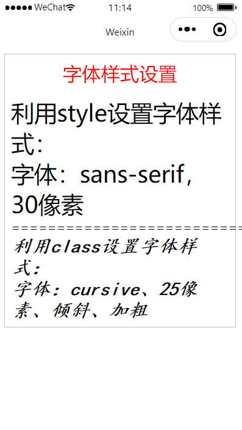
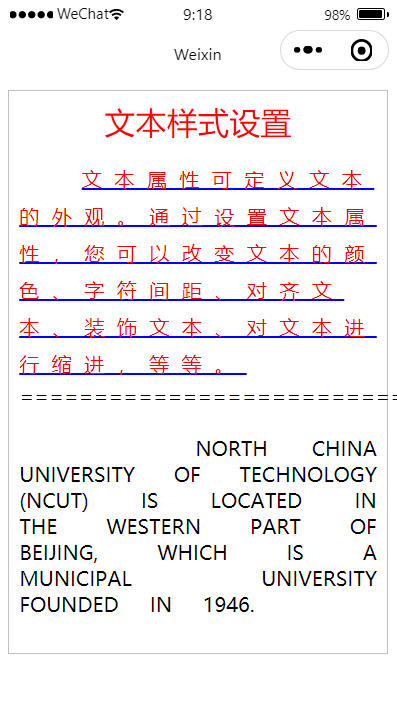

[TOC]

# 微信小程序

## 第一章 初识微信小程序

### 1.1 注册小程序账号

小程序官网：https://mp.weixin.qq.com/cgi-bin/wx

邮箱：dxtterry@gmail.com

【开发】->【开发管理】->【开发设置】->【APPID】： wxf4df2562207e1992

【首页】->【小程序开发与管理】->【普通小程序开发者工具】->【微信开发者工具】->【稳定版Windows64】

<div STYLE="page-break-after: always;"></div>

### 1.2 第一个微信小程序

创建小程序：填写【目录（桌面）】、【APPID】、【开发模式：小程序】、【不使用云服务】、【JavaScript基础模板】

开发者工具：

1. 模拟器
2. 编辑器
3. 调试器
4. 资源管理器
5. 预览/真机调试

```html
<!--index.wxml-->
<view>Hello Wechat!</view>
```

<div STYLE="page-break-after: always;"></div>

### 1.3 字体样式设置

设计一个小程序，分别利用style和class属性设置字体样式，在`index.wxss`中定义样式类。所有的文字都包含在一个边框内，边框内上方有标题文字，边框和标题样例利用class属性来设置，在`app.wxss`中定义样式类。



1. 添加两段文本

```html
<!--index.wxml-->

<view>
  <view>利用style设置字体样式：</view>
  <view>字体：sans-serif，30像素</view>
</view>
===========================
<view>
  <view>利用class设置字体样式：</view>
  <view>字体：cursive、25像素、倾斜、加粗</view>
</view>
```

2. 添加style属性

```html
<!--index.wxml-->

<view style="font-family: sans-serif; font-size: 30px;">
  <view>利用style设置字体样式：</view>
  <view>字体：sans-serif，30像素</view>
</view>
===========================
<view>
  <view>利用class设置字体样式：</view>
  <view>字体：cursive、25像素、倾斜、加粗</view>
</view>
```

3. 添加class类

```css
/**index.wxss**/

.fontStyle {
  font-family: cursive;
  font-size: 25px;
  font-style: italic;
  font-weight: bold;
}
```

```html
<!--index.wxml-->

<view style="font-family: sans-serif; font-size: 30px;">
  <view>利用style设置字体样式：</view>
  <view>字体：sans-serif，30像素</view>
</view>
===========================
<view class="fontStyle">
  <view>利用class设置字体样式：</view>
  <view>字体：cursive、25像素、倾斜、加粗</view>
</view>
```

4. 添加边框

```css
/**app.wxss**/

.box {
  border: 1px solid silver;
}
```

```html
<!--index.wxml-->

<view class="box">
  <view style="font-family: sans-serif; font-size: 30px;">
    <view>利用style设置字体样式：</view>
    <view>字体：sans-serif，30像素</view>
  </view>
  ===========================
  <view class="fontStyle">
    <view>利用class设置字体样式：</view>
    <view>字体：cursive、25像素、倾斜、加粗</view>
  </view>
</view>
```

5. 设置边框相对边距

```css
/**app.wxss**/

.box {
  border: 1px solid silver;
  margin: 20rpx;
  padding: 20rpx;
}
```

6. 添加标题

```css
/**app.wxss**/

.box {
  border: 1px solid silver;
  margin: 20rpx;
  padding: 20rpx;
}

.title {
  font-size: 25px;
  text-align: center;
  margin-bottom: 15px;
  color: red;
}
```

```html
<!--index.wxml-->

<view class="box">
  <view class="title">字体样式设置</view>
  <view style="font-family: sans-serif; font-size: 30px;">
    <view>利用style设置字体样式：</view>
    <view>字体：sans-serif，30像素</view>
  </view>
  ===========================
  <view class="fontStyle">
    <view>利用class设置字体样式：</view>
    <view>字体：cursive、25像素、倾斜、加粗</view>
  </view>
</view>
```

| 属性        | 含义     | 说明                                              |
| ----------- | -------- | ------------------------------------------------- |
| font-family | 字体类型 | Serif, Sans-serif, Monospace, Cursive, Fantasy    |
| font-size   | 字体大小 | 5px/rpx/cm, large, small, medium, larger, smaller |
| font-style  | 字体倾斜 | italic, normal, oblique                           |
| font-weight | 字体加粗 | bold, bolder, lighter                             |

view组件支持使用style和class属性来设置组件的样式。

利用style可直接在WXML文件中设置，利用class需要先在WXSS文件中定义样式类。

静态样式一眼使用class设置，动态样式一般使用style设置，这样可以提高渲染速度。


在`app.wxss`中定义的样式类属于全局样式类，可以在项目的任何文件中使用。

在`index.wxss`中定义的样式类一般只在`index.wxml`中使用。

<div STYLE="page-break-after: always;"></div>

### 1.4 文本样式设置

创建一个微信小程序，利用class属性设置文本样式，包括：文本的颜色、字符间距、对齐文本、装饰文本、对文本进行缩进，等等。



1. 添加两段文本

```html
<!--index.wxml-->

<view class="box">
  <view class="title">文本样式设置</view>
  <view class="textStyle01">
    文本属性可定义文本的外观。通过设置文本属性，您可以改变文本的颜色、字符间距、对齐文本、装饰文本、对文本进行缩进，等等。
  </view>
  ===========================
  <view class="textStyle02">
    North China University of Technology (NCUT) is located in the western part of Beijing, which is a municipal university founded in 1946.
  </view>
</view>
```

2. 重复利用1.3章节中的`app.wxss`样式

```css
/**app.wxss**/

.box {
  border: 1px solid silver;
  margin: 20rpx;
  padding: 20rpx;
}

.title {
  font-size: 25px;
  text-align: center;
  margin-bottom: 15px;
  color: red;
}
```

3. 设置样式

```css
/**index.wxss**/

.textStyle01 {
  color: red;
  letter-spacing: 10px;
  text-align: left;
  text-indent: 50px;
  text-decoration: underline;
  text-decoration-color: #00f;
  line-height: 30px;
  white-space: normal;
}

.textStyle02 {
  text-align: justify;
  word-spacing: 20px;
  text-transform: uppercase;
  white-space: pre-wrap;
}
```

| 属性                  | 含义                       |
| --------------------- | -------------------------- |
| color                 | 字体颜色                   |
| text-align            | 文本对齐方式               |
| text-indent           | 首行缩进                   |
| letter-spacing        | 字母之间的距离             |
| word-spacing          | 单词间距，以空格来区分单词 |
| white-space           | 文档中的空白处             |
| text-decoration       | 文本修饰样式               |
| text-decoration-color | 文本修饰颜色               |

<div STYLE="page-break-after: always;"></div>

### 1.5 图片与声音

设计一个小程序，小程序运行后显示一张猫图，点击猫图后会发出猫叫的声音。

1. 添加标题和样式

```html
<!--index.wxml-->

<view class="box">
  <view class="title">图片和声音</view>
</view>
```

```css
/**app.wxss**/

.box {
  border: 1px solid silver;
  margin: 20rpx;
  padding: 20rpx;
}

.title {
  font-size: 25px;
  text-align: center;
  margin-bottom: 15px;
  color: red;
}
```

2. 添加图片路径，绑定点击事件

```html
<!--index.wxml-->

<view class="box">
  <view class="title">图片和声音</view>
  <view>
    <image src="{{imgSrc}}" bindtap="tapCat"></image>
  </view>
</view>
```

3. 设置图片路径

```js
// index.js

Page({
  data: {
    imgSrc: "/images/kitty.png"
  },
  // 事件处理函数
})
```

> 如图片显示超出边框，更换机型。

4. 实现tap事件

```js
// index.js

Page({
	data: {
		imgSrc: "/images/kitty.png"
	},
	// 事件处理函数
	tapCat: function () {
		let audio = wx.createInnerAudioContext();
		audio.src = "audios/meow.mp3";
		audio.play();
	}
})
```

images组件：支持JPG、PNG、SVG格式，用`src`属性指定图片的路径。

音频：首先利用API函数`wv.createInnerAudioContext()`创建音频上下文，然后设置该上下文的`src`，并利用`play()`函数播放音频。

数据绑定：WXML文件中的动态数据通过`{{}}`符号与JS文件中的数据进行绑定，这样JS中的数据就可以传给WXML文件。这种传递是单向的。

事件绑定：在WXML文件组件标签内利用`bind...=函数名`绑定组件事件与函数，并在JS文件中定义该事件函数。

<div STYLE="page-break-after: always;"></div>

## 第2章 盒模型与页面布局

### 2.1 盒模型

