[TOC]

# 微信小程序

## 第1章 初识微信小程序

### 1.1 注册小程序账号

小程序官网：https://mp.weixin.qq.com/cgi-bin/wx

邮箱：

【开发】->【开发管理】->【开发设置】->【APPID】： 

【首页】->【小程序开发与管理】->【普通小程序开发者工具】->【微信开发者工具】->【稳定版Windows64】

<div STYLE="page-break-after: always;"></div>

### 1.2 查看小程序的AppID

<div STYLE="page-break-after: always;"></div>

### 1.3 设置小程序信息

<div STYLE="page-break-after: always;"></div>

### 1.4 下载并安装小程序开发者工具

<div STYLE="page-break-after: always;"></div>

### 1.5 创建和打开小程序

<div STYLE="page-break-after: always;"></div>

### 1.6 第一个微信小程序

创建小程序：填写【目录（桌面）】、【APPID】、【开发模式：小程序】、【不使用云服务】、【JavaScript基础模板】

开发者工具：

1. 模拟器
2. 编辑器
3. 调试器
4. 资源管理器
5. 预览/真机调试

```html
<!--index.wxml-->
<view>Hello Wechat!</view>
```

<div STYLE="page-break-after: always;"></div>

## 第2章 小程序编写基础

### 2.1 字体样式设置

设计一个小程序，分别利用style和class属性设置字体样式，在`index.wxss`中定义样式类。所有的文字都包含在一个边框内，边框内上方有标题文字，边框和标题样例利用class属性来设置，在`app.wxss`中定义样式类。

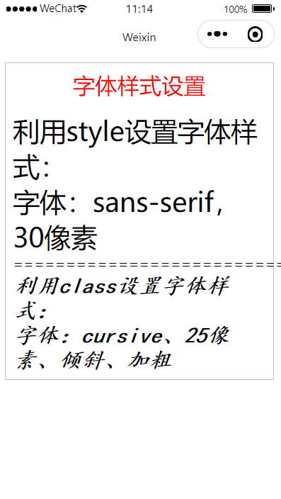

1. 添加两段文本

```html
<!--index.wxml-->

<view>
  <view>利用style设置字体样式：</view>
  <view>字体：sans-serif，30像素</view>
</view>
===========================
<view>
  <view>利用class设置字体样式：</view>
  <view>字体：cursive、25像素、倾斜、加粗</view>
</view>
```

2. 添加style属性

```html
<!--index.wxml-->

<view style="font-family: sans-serif; font-size: 30px;">
  <view>利用style设置字体样式：</view>
  <view>字体：sans-serif，30像素</view>
</view>
===========================
<view>
  <view>利用class设置字体样式：</view>
  <view>字体：cursive、25像素、倾斜、加粗</view>
</view>
```

3. 添加class类

```css
/**index.wxss**/

.fontStyle {
  font-family: cursive;
  font-size: 25px;
  font-style: italic;
  font-weight: bold;
}
```

```html
<!--index.wxml-->

<view style="font-family: sans-serif; font-size: 30px;">
  <view>利用style设置字体样式：</view>
  <view>字体：sans-serif，30像素</view>
</view>
===========================
<view class="fontStyle">
  <view>利用class设置字体样式：</view>
  <view>字体：cursive、25像素、倾斜、加粗</view>
</view>
```

4. 添加边框

```css
/**app.wxss**/

.box {
  border: 1px solid silver;
}
```

```html
<!--index.wxml-->

<view class="box">
  <view style="font-family: sans-serif; font-size: 30px;">
    <view>利用style设置字体样式：</view>
    <view>字体：sans-serif，30像素</view>
  </view>
  ===========================
  <view class="fontStyle">
    <view>利用class设置字体样式：</view>
    <view>字体：cursive、25像素、倾斜、加粗</view>
  </view>
</view>
```

5. 设置边框相对边距

```css
/**app.wxss**/

.box {
  border: 1px solid silver;
  margin: 20rpx;
  padding: 20rpx;
}
```

6. 添加标题

```css
/**app.wxss**/

.box {
  border: 1px solid silver;
  margin: 20rpx;
  padding: 20rpx;
}

.title {
  font-size: 25px;
  text-align: center;
  margin-bottom: 15px;
  color: red;
}
```

```html
<!--index.wxml-->

<view class="box">
  <view class="title">字体样式设置</view>
  <view style="font-family: sans-serif; font-size: 30px;">
    <view>利用style设置字体样式：</view>
    <view>字体：sans-serif，30像素</view>
  </view>
  ===========================
  <view class="fontStyle">
    <view>利用class设置字体样式：</view>
    <view>字体：cursive、25像素、倾斜、加粗</view>
  </view>
</view>
```

| 属性        | 含义     | 说明                                              |
| ----------- | -------- | ------------------------------------------------- |
| font-family | 字体类型 | Serif, Sans-serif, Monospace, Cursive, Fantasy    |
| font-size   | 字体大小 | 5px/rpx/cm, large, small, medium, larger, smaller |
| font-style  | 字体倾斜 | italic, normal, oblique                           |
| font-weight | 字体加粗 | bold, bolder, lighter                             |

view组件支持使用style和class属性来设置组件的样式。

利用style可直接在WXML文件中设置，利用class需要先在WXSS文件中定义样式类。

静态样式一眼使用class设置，动态样式一般使用style设置，这样可以提高渲染速度。


在`app.wxss`中定义的样式类属于全局样式类，可以在项目的任何文件中使用。

在`index.wxss`中定义的样式类一般只在`index.wxml`中使用。

<div STYLE="page-break-after: always;"></div>

### 2.2 文本样式设置

创建一个微信小程序，利用class属性设置文本样式，包括：文本的颜色、字符间距、对齐文本、装饰文本、对文本进行缩进，等等。

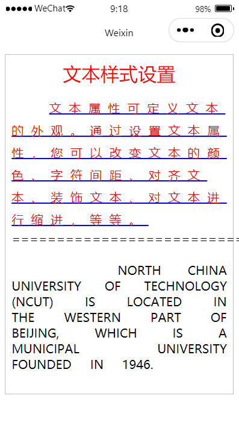

1. 添加两段文本

```html
<!--index.wxml-->

<view class="box">
  <view class="title">文本样式设置</view>
  <view class="textStyle01">
    文本属性可定义文本的外观。通过设置文本属性，您可以改变文本的颜色、字符间距、对齐文本、装饰文本、对文本进行缩进，等等。
  </view>
  ===========================
  <view class="textStyle02">
    North China University of Technology (NCUT) is located in the western part of Beijing, which is a municipal university founded in 1946.
  </view>
</view>
```

2. 重复利用1.3章节中的`app.wxss`样式

```css
/**app.wxss**/

.box {
  border: 1px solid silver;
  margin: 20rpx;
  padding: 20rpx;
}

.title {
  font-size: 25px;
  text-align: center;
  margin-bottom: 15px;
  color: red;
}
```

3. 设置样式

```css
/**index.wxss**/

.textStyle01 {
  color: red;
  letter-spacing: 10px;
  text-align: left;
  text-indent: 50px;
  text-decoration: underline;
  text-decoration-color: #00f;
  line-height: 30px;
  white-space: normal;
}

.textStyle02 {
  text-align: justify;
  word-spacing: 20px;
  text-transform: uppercase;
  white-space: pre-wrap;
}
```

| 属性                  | 含义                       |
| --------------------- | -------------------------- |
| color                 | 字体颜色                   |
| text-align            | 文本对齐方式               |
| text-indent           | 首行缩进                   |
| letter-spacing        | 字母之间的距离             |
| word-spacing          | 单词间距，以空格来区分单词 |
| white-space           | 文档中的空白处             |
| text-decoration       | 文本修饰样式               |
| text-decoration-color | 文本修饰颜色               |

<div STYLE="page-break-after: always;"></div>

### 2.3 图片与声音

设计一个小程序，小程序运行后显示一张猫图，点击猫图后会发出猫叫的声音。

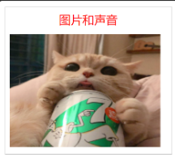

1. 添加标题和样式

```html
<!--index.wxml-->

<view class="box">
  <view class="title">图片和声音</view>
</view>
```

```css
/**app.wxss**/

.box {
  border: 1px solid silver;
  margin: 20rpx;
  padding: 20rpx;
}

.title {
  font-size: 25px;
  text-align: center;
  margin-bottom: 15px;
  color: red;
}
```

2. 添加图片路径，绑定点击事件

```html
<!--index.wxml-->

<view class="box">
  <view class="title">图片和声音</view>
  <view>
    <image src="{{imgSrc}}" bindtap="tapCat"></image>
  </view>
</view>
```

3. 设置图片路径

```js
// index.js

Page({
  data: {
    imgSrc: "/images/kitty.png"
  },
  // 事件处理函数
})
```

> 如图片显示超出边框，更换机型。

4. 实现tap事件

```js
// index.js

Page({
	data: {
		imgSrc: "/images/kitty.png"
	},
	// 事件处理函数
	tapCat: function () {
		let audio = wx.createInnerAudioContext();
		audio.src = "audios/meow.mp3";
		audio.play();
	}
})
```

images组件：支持JPG、PNG、SVG格式，用`src`属性指定图片的路径。

音频：首先利用API函数`wv.createInnerAudioContext()`创建音频上下文，然后设置该上下文的`src`，并利用`play()`函数播放音频。

数据绑定：WXML文件中的动态数据通过`{{}}`符号与JS文件中的数据进行绑定，这样JS中的数据就可以传给WXML文件。这种传递是单向的。

事件绑定：在WXML文件组件标签内利用`bind...=函数名`绑定组件事件与函数，并在JS文件中定义该事件函数。

<div STYLE="page-break-after: always;"></div>

### 2.4 盒模型

设计一个小程序，利用盒模型的相关属性实现不同的布局模式。

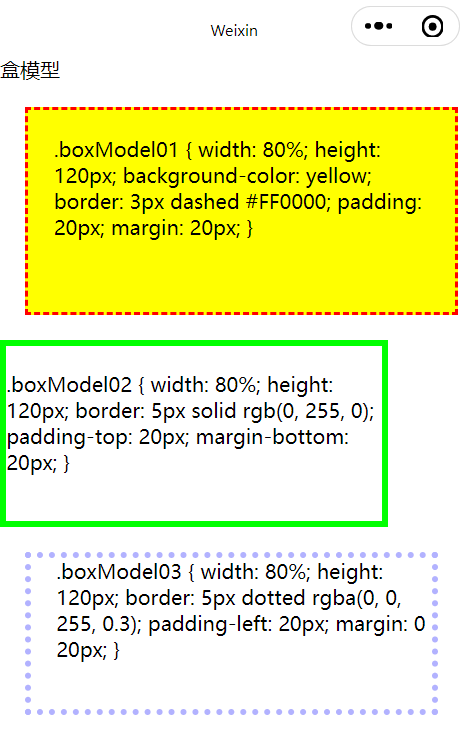

1. 添加三段文本

```html
<!--index.wxml-->

<view class="box">
	<view class="title">盒模型</view>
	<view class="boxModel01">
		.boxModel01 { width: 80%; height: 120px; background-color: yellow; border: 3px dashed #FF0000; padding: 20px; margin: 20px; }
	</view>
	<view class="boxModel02">
		.boxModel02 { width: 80%; height: 120px; border: 5px solid rgb(0, 255, 0); padding-top: 20px; margin-bottom: 20px; }
	</view>
	<view class="boxModel03">
		.boxModel03 { width: 80%; height: 120px; border: 5px dotted rgba(0, 0, 255, 0.3); padding-left: 20px; margin: 0 20px; }
	</view>
</view>
```

2. 设置盒模型样式

```css
/**index.wxss**/

.boxModel01 {
	width: 80%;
	height: 120px;
	background-color: yellow;
	border: 3px dashed #FF0000;
	padding: 20px;
	margin: 20px;
}

.boxModel02 {
	width: 80%;
	height: 120px;
	border: 5px solid rgb(0, 255, 0);
	padding-top: 20px;
	margin-bottom: 20px;
}

.boxModel03 {
  width: 80%;
  height: 120px;
  border: 5px dotted rgba(0, 0, 255, 0.3);
  padding-left: 20px;
  margin: 0 20px; /* 外上下边距为0，左右边距为20px */
}
```

所有WXML元素都可以看作盒子，在WXSS中，box model这一术语是用来设计和布局时使用。盒模型本质上是一个盒子，封装周围的WXML元素，它包括：边距、边框、填充和实际内容。


边框样式：`border-style`属性用来定义边框的样式。

| 边框样式 | 说明                                         |
| -------- | -------------------------------------------- |
| none     | 默认无边框                                   |
| dotted   | 定义一个点线边框                             |
| dashed   | 定义一个虚线边框                             |
| solid    | 定义实现边框                                 |
| double   | 定义两个边框                                 |
| groove   | 定义3D沟槽边框，效果取决于边框的颜色值       |
| ridge    | 定义3D脊边框，效果取决于边框的颜色值         |
| inset    | 定义一个3D的嵌入边框，效果取决于边框的颜色值 |
| outset   | 定义一个3D突出边框，效果取决于边框的颜色值   |

边框宽度：`border-width`属性用于设置边框宽度。

边框颜色：`border-color`属性用于设置边框的颜色。

单独设置各边：可以通过`border-top`、`border-right`、`border-bottom`、`border-left`属性设置不同侧面的边框。

一次性设置边框属性：可以利用`border`属性一次性设置边框宽度、边框样式和边框颜色。如`border: 3px dashed #00ff00`。

<div STYLE="page-break-after: always;"></div>

### 2.5 flex页面布局

设计一个小程序，利用flex弹性盒模型布局实现三栏布局、左右混合布局和上下混合布局。

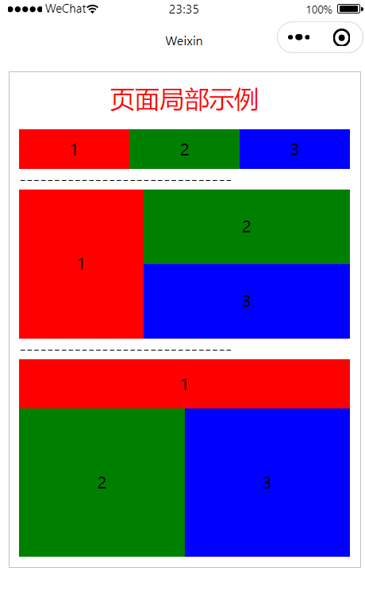

```html
<!--index.wxml-->

<view class="box">
  <view class="title">页面局部示例</view>

  <!-- 实现三栏水平均匀布局 -->
  <view style="display: flex; text-align: center; line-height: 80rpx;">
    <view style="background-color: red; flex-grow: 1;">1</view>
    <view style="background-color: green; flex-grow: 1;">2</view>
    <view style="background-color: blue; flex-grow: 1;">3</view>
  </view>
  -------------------------------

  <!-- 实现左右混合布局 -->
  <view style="display: flex; height: 300rpx; text-align: center;">
    <view style="background-color: red; width: 250rpx; line-height: 300rpx;">1</view>
    <view style="display: flex; flex-direction: column; flex-grow: 1; line-height: 150rpx;">
      <view style="background-color: green; flex-grow: 1;">2</view>
      <view style="background-color: blue; flex-grow: 1;">3</view>
    </view>
  </view>
  -------------------------------

  <!-- 实现上下混合布局 -->
  <view style="display: flex; flex-direction: column; line-height: 300rpx; text-align: center;">
    <view style="background-color: red; height: 100rpx; line-height: 100rpx;">1</view>
    <view style="flex-grow: 1; display: flex; flex-direction: row;">
      <view style="background-color: green; flex-grow: 1;">2</view>
      <view style="background-color: blue; flex-grow: 1;">3</view>
    </view>
  </view>
</view>
```

Flex是Flexible Box的缩写，意为“弹性布局”，用来对盒状模型进行布局。

| 属性            | 含义                                 | 合法值                                                       |
| --------------- | ------------------------------------ | ------------------------------------------------------------ |
| flex-direction  | 设置主轴方向（即项目排列方向）       | row, row-reverse, column, column-reverse                     |
| flex-wrap       | 如果一条轴线排不下，如何换行         | nowrap, wrap, wrap-reverse                                   |
| justify-content | 项目沿主轴方向的对齐方式             | flex-start, flex-end, center, space-between, space-around    |
| align-items     | 项目在交叉轴上的对齐方式             | flex-start, flex-end, center, baseline, stretch              |
| align-content   | 酵母在交叉轴上有多根轴线时的对齐方式 | flex-start, flex-end, center, space-between, space-around, stretch |

| 属性        | 说明                                                         |
| ----------- | ------------------------------------------------------------ |
| order       | 项目的排列顺序。数值越小，排列越靠前，默认为0                |
| flex-grow   | 各项目宽度之和小于容器宽度时，各项目分配容器剩余宽度的方法比例，默认为0，即不方法 |
| flex-shrink | 各项目宽度之和大于容器宽度时，各项目缩小自己宽度的比例，默认为1，即将项目缩小 |
| flex-basis  | 元素宽度的属性，和width功能相同，但比width的优先级高         |
| flex        | 是flex-grow、flex-shrink和flex-basis的简写，默认值为0 1 auto，后两个属性可选 |
| align-self  | 允许单个项目有与其它项目不一样的对齐方式，可覆盖align-items属性。默认值为auto，表示继承父元素的align-items属性，如果没有父元素，则等同于stretch |

`line-height`可以理解为每行文字所占的空度。比如说有一行高度为20px的文字，如果设置为`line-height: 50px`，那就是说，这行文字的高度会占50px，由于每个字的高度只有20px，于是浏览器就把多出来的30px（50px - 20px）在这行文字的上面加上了15px、下面加上了15px，这样文字就在这50px的空间内是居中的了。

<div STYLE="page-break-after: always;"></div>

### 2.6 导航与布局

设计一个实现导航功能的小程序。导航页面包含多行导航内容，每行导航内容包括1个图标、1个说明文本和1个图片，图标在最左侧，文本在图标右侧，图片在最右侧。当点击某一行导航内容时都能进入相应的页面。

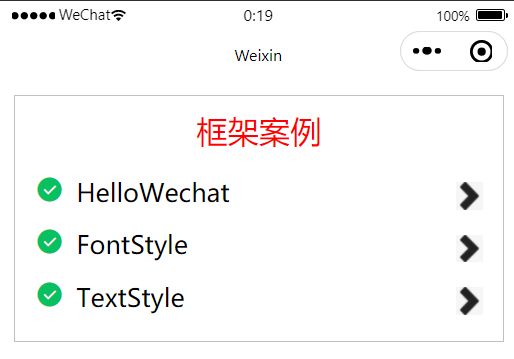

1. 设计页面

```html
<!--index.wxml-->

<view class="box">
  <view class="title">框架案例</view>

  <navigator url="/pages/HelloWechat/index">
    <view class="waikuang">
      <icon type="success" class="myleft"></icon>
      <view class="mycenter">HelloWechat</view>
      <image src="/images/right-arrow.png" class="myright"></image>
    </view>
  </navigator>
</view>
```

2. 更改样式

```css
/**index.wxss**/

navigator {
  margin: 5px;
  font-size: 20px;
}

.waikuang {
  display: flex;
  flex-direction: row;
  margin: 5px 0px;
  padding: 5px 0px;
}

.myleft {
  margin-right: 10px;
}

.mycenter {
  flex: 1;
}

.myright {
  width: 40rpx;
  height: 40rpx;
  margin-top: 5px;
}
```

3. 将`HelloWechat`目录放到`pages`目录下

    HelloWechat

    	- index.js
    	- index.json
    	- index.wxml
    	- index.wxss

4. 修改配置文件，添加页面

```json
{
  "pages":[
    "pages/index/index",
    "pages/logs/logs",
    "pages/HelloWechat/index"
  ],
  "window":{
    "backgroundTextStyle":"light",
    "navigationBarBackgroundColor": "#fff",
    "navigationBarTitleText": "Weixin",
    "navigationBarTextStyle":"black"
  },
  "style": "v2",
  "sitemapLocation": "sitemap.json"
}
```

5. 使用相同方法，完成其它导航栏。

```html
<!--index.wxml-->

<view class="box">
  <view class="title">框架案例</view>

  <navigator url="/pages/HelloWechat/index">
    <view class="waikuang">
      <icon type="success" class="myleft"></icon>
      <view class="mycenter">HelloWechat</view>
      <image src="/images/right-arrow.png" class="myright"></image>
    </view>
  </navigator>

  <navigator url="/pages/FontStyle/index">
    <view class="waikuang">
      <icon type="success" class="myleft"></icon>
      <view class="mycenter">FontStyle</view>
      <image src="/images/right-arrow.png" class="myright"></image>
    </view>
  </navigator>

  <navigator url="/pages/TextStyle/index">
    <view class="waikuang">
      <icon type="success" class="myleft"></icon>
      <view class="mycenter">TextStyle</view>
      <image src="/images/right-arrow.png" class="myright"></image>
    </view>
  </navigator>
</view>
```

```json
{
  "pages":[
    "pages/index/index",
    "pages/logs/logs",
    "pages/HelloWechat/index",
    "pages/FontStyle/index",
    "pages/TextStyle/index"
  ],
  "window":{
    "backgroundTextStyle":"light",
    "navigationBarBackgroundColor": "#fff",
    "navigationBarTitleText": "Weixin",
    "navigationBarTextStyle":"black"
  },
  "style": "v2",
  "sitemapLocation": "sitemap.json"
}
```

`navigator`组件能够实现页面导航

- navigator组件属性

| 属性      | 说明                                                         |
| --------- | ------------------------------------------------------------ |
| target    | 在哪个目标上发生跳转，其合法值为self和miniProgram，默认值为self |
| url       | 当前小程序内的跳转地址                                       |
| open-type | 跳转方式                                                     |
| delta     | 当open-type为'navigatorBack'时有效，表示回退的层数           |
| app-id    | 当target="miniProgram"时有效，要打开的小程序的appId          |
| path      | 当target="miniProgram"时有效，打开的页面路径如果为空则打开首页 |

- open-type合法值

| 值           | 说明                                         |
| ------------ | -------------------------------------------- |
| navigate     | 保留当前页面，跳转到应用内的某个页面         |
| redirect     | 关闭当前页面，跳转到应用内的某个页面         |
| switchTab    | 跳转到tabBar页面，并关闭其它所有非tabBar页面 |
| reLaunch     | 关闭所有页面，打开应用内的某个页面           |
| navigateBack | 关闭当前页面，返回上一页面或多级页面         |
| exit         | 退出小程序，target="miniProgram"时生效       |

`icon`组件显示一个图标

- icon组件属性

| 属性名 | 说明                                                         |
| ------ | ------------------------------------------------------------ |
| type   | icon的类型，有效值：success, success_no_circle, info, warn, waiting, cancel, download, search, clear |
| size   | icon的大小                                                   |
| color  | icon的颜色                                                   |

<div STYLE="page-break-after: always;"></div>

### 2.7 Float页面布局

设计一个小程序，利用float布局实现相应的布局效果。

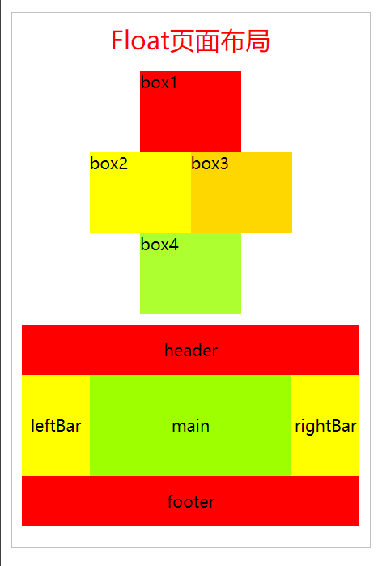

1. 实现结构

```html
<!--index.wxml-->

<view class="box">
  <view class="title">Float页面布局</view>

  <view class="bg1">
    <view class="box1">box1</view>
    <view class="box2">box2</view>
    <view class="box3">box3</view>
    <view class="box4">box4</view>
  </view>

  <view class="bg2">
    <view class="header">header</view>
    <view class="leftBar">leftBar</view>
    <view class="main">main</view>
    <view class="rightBar">rightBar</view>
    <view class="footer">footer</view>
  </view>
</view>
```

2. 实现样式

```css
/**index.wxss**/

.bg1 {
  height: 240px;
  width: 200px;
  margin: 10px auto;  /* 上下边距为10px，左右边距平均分配（实现水平居中对齐） */
}

.box1 {
  width: 100px;
  height: 80px;
  background-color: red;
  margin: 0 auto;
}

.box2 {
  width: 100px;
  height: 80px;
  background-color: yellow;
  float: left;
}

.box3 {
  width: 100px;
  height: 80px;
  background-color: gold;
  float: right;
}

.box4 {
  width: 100px;
  height: 80px;
  background-color: greenyellow;
  clear: both;  /* 清除左右两边浮动 */
  margin: 0 auto;
}

.bg2 {
  height: 400rpx;
  text-align: center;
  margin: 10px auto;
}

.header {
  line-height: 100rpx;
  background-color: red;
}

.leftBar {
  width: 20%;
  line-height: 200rpx;
  background-color: yellow;
  float:left;
}

.main {
  width: 60%;
  line-height: 200rpx;
  background-color: rgb(157, 255, 0);
  float: left;
}

.rightBar {
  width: 20%;
  line-height: 200rpx;
  background-color: yellow;
  float: right;
}

.footer {
  line-height: 100rpx;
  background-color: red;
  clear: both;
}
```

`float`属性：浮动的框可以向左或向右移动，直到它的外边缘碰到包含框或另一个浮动框的边框为止。

| 值      | 描述                                             |
| ------- | ------------------------------------------------ |
| left    | 元素向左浮动                                     |
| right   | 元素向右浮动                                     |
| none    | 默认值，元素不浮动，并会显示其在文本中出现的位置 |
| inherit | 规定应该从父元素继承float属性的值                |

`clear`属性：清除浮动。

| 合法值  | 说明                               |
| ------- | ---------------------------------- |
| left    | 在左侧不允许有浮动元素             |
| right   | 在右侧不允许有浮动元素             |
| both    | 在左右两侧均不允许有浮动元素       |
| none    | 默认值，允许浮动元素出现在左右两侧 |
| inherit | 继承父元素clear属性的值            |

利用`margin`属性实现水平居中对齐：如果要实现元素的水平居中对齐，可以通过让`margin`左右边距为`auto`的方式来实现，这样块元素将平均分配左右边距，从而实现水平居中对齐。

<div STYLE="page-break-after: always;"></div>

### 2.8 摄氏温度转华氏温度

设计一个根据设置温度C求华氏温度F的微信小程序，计算公式如下：
$$
F = (9 / 5) * C + 32
$$
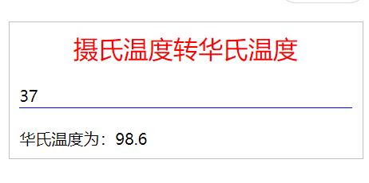

1. 实现页面

```html
<!--index.wxml-->

<view class="box">
  <view class="title">摄氏温度转华氏温度</view>
  <view>
    <input placeholder="请输入摄氏温度" type="digit" bindblur="calc"></input>
  </view>
  <view>华氏温度为：{{F}}</view>
</view>
```

2. 实现样式

```css
/**index.wxss**/

input {
  margin: 20px 0; /* 设置上下边距为20px，左右边距为0 */
  border-bottom: 1px solid blue;  /* 下边框粗细为1px、实线、蓝色 */
}
```

3. 实现逻辑

```js
// index.js

Page({
  calc: function(e) {
    var C;
    C = e.detail.value; // 获取input组件中输入的数值
    this.setData({		// setData传入对象
      F: C * 9 / 5 + 32
    })
  }
})
```

`input`输入框组件：用于输入数据。

| 属性名            | 说明                                       |
| ----------------- | ------------------------------------------ |
| value             | 输入框中的内容                             |
| type              | input的类型                                |
| password          | 是否是密码类型                             |
| placeholder       | 输入框为空时占位符                         |
| placeholder-style | 指定placeholder的样式                      |
| maxlength         | 最大输入长度，设置为-1的时候不限制最大长度 |
| bindinput         | 键盘输入时触发                             |
| bindfocus         | 输入框聚焦时触发                           |
| bindblur          | 输入框失去焦点时触发                       |

`type`属性：真机运行时键盘的类型。

| 值     | 说明               |
| ------ | ------------------ |
| text   | 文本输入键盘       |
| number | 数字输入键盘       |
| idcard | 身份证输入键盘     |
| digit  | 带小数点的数字键盘 |

<div STYLE="page-break-after: always;"></div>

### 2.9 条件结构和数学函数

设计一个利用条件结构和数学函数进行计算的小程序。当输入x值时，根据下面的公式计算出y的值。
$$
y = |x| \ (x < 0)\\
y = e^x sinx \ (0 \le x \le 10)\\
y = x^3 \ (10 \le x < 20)\\
y = (3 +2x)lnx \ (x \ge 20)
$$

1. 实现页面

```html
<!--index.wxml-->
<view class="box">
  <view class="title">条件语句和数学函数</view>
  <view>
    <input placeholder="请输入x的值" bindblur="calc"></input>
  </view>
  <view>计算y的值为：{{y}}</view>
</view>
```

2. 实现样式

```css
/**index.wxss**/

input {
  border-bottom: 1px solid blue;
  margin: 20px 0; /* 上下外边距为20px，左右外边距为0 */
}
```

3. 实现逻辑

```js
// index.js

Page({
  calc: function(e) {
    var x, y;
    var x = e.detail.value; // 获取input组件的value值

    if(x < 0) {
      y = Math.abs(x);
    } else if(x < 10) {
      y = Math.exp(x) * Math.sin(x);
    } else if(x < 20) {
      y = Math.pow(x, 3);
    } else {
      y = (3 + 2 * x) * Math.log(x);
    }

    this.setData({
      y: y
    })
  }
})
```

`Math`对象：用于执行数学任务。

| 属性和方法 | 说明                                           |
| ---------- | ---------------------------------------------- |
| E          | 返回算术常量e，即自然对数的底数（约等于2.718） |
| PI         | 返回圆周率（约等于3.14159）                    |
| abs(x)     | 返回数的绝对值                                 |
| ceil(x)    | 对数进行上舍入                                 |
| cos(x)     | 返回数的余弦                                   |
| exp(x)     | 返回e的指数                                    |
| floor(x)   | 对数进行下舍入                                 |
| log(x)     | 返回数的自然对数（底为e）                      |
| max(x, y)  | 返回x和y中的最高值                             |
| min(x, y)  | 返回x和y中的最低值                             |
| pow(x, y)  | 返回x的y次幂                                   |
| random()   | 返回0-1之间的随机数                            |
| round(x)   | 把数四舍五入为最接近的整数                     |
| sin(x)     | 返回数的正弦                                   |
| sqrt(x)    | 返回数的平方根                                 |
| tan(x)     | 返回角的正切                                   |
| valueOf()  | 返回Math对象的原始值                           |

<div STYLE="page-break-after: always;"></div>

### 2.10 学生成绩计算器

设计一个计算学生平均成绩的小程序。当输入学生信息和各门功课成绩并提交后，能够显示学生的信息及平均成绩。

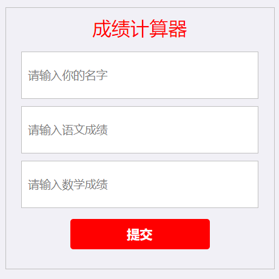

1. 实现页面

```html
<!--index.wxml-->

<view class="box">
  <view class="title">成绩计算器</view>
  
  <input placeholder="请输入你的名字" placeholder-class="placeholder" bindinput="nameInput"></input>
  <input placeholder="请输入语文成绩" placeholder-class="placeholder" bindinput="chineseInput" type="number"></input>
  <input placeholder="请输入数学成绩" placeholder-class="placeholder" bindinput="mathInput" type="number"></input>

  <button bindtap="mysubmit">提交</button>

  <view hidden="{{flag}}" class="content">
    <view class="content-item">姓名：{{name}}</view>
    <view class="content-item">语文成绩：{{chinese_score}}</view>
    <view class="content-item">数学成绩：{{math_score}}</view>
    <view class="content-item">平均成绩：{{average}}</view>
  </view>
</view>
```

2. 实现样式

```css
/**index.wxss**/

page {
  background: #f1f0f6;
}

.placeholder {
  font-size: 15px;
}

input {
  background: #fff;
  height: 120rpx;
  margin: 10px;
  padding-left: 8px;
  border: solid 1px silver;
}

button {
  margin: 30rpx 50rpx;
  background-color: red;
  color: white;
}

.content {
  background: #fff;
  padding: 10px;
  color: #f00;
}

.content-item {
  padding: 3rpx;
  font-size: 16px;
  line-height: 30px;
}
```

3. 实现逻辑

```js
// index.js

Page({
  data: {
    flag: true,
    name: '',
    chinese_score: '',
    math_score: '',
    average: ''
  },

  nameInput: function(e) {
    console.log("name");
    this.setData({
      name: e.detail.value
    });
  },

  chineseInput: function(e) {
    this.setData({
      chinese_score: e.detail.value
    });
  },

  mathInput: function(e) {
    this.setData({
      math_score: e.detail.value
    });
  },

  mysubmit: function() {
    console.log("test");
    if(this.data.name == "" || this.data.chinese_score == "" || this.data.math_score == "") {
      
      return;
    } else {
      var avg = (this.data.chinese_score * 1 + this.data.math_score * 1) / 2;
      this.setData({
        flag: false,
        average: avg,
      });
    }
  }
})
```

`button`组件

| 属性      | 说明                                                         |
| --------- | ------------------------------------------------------------ |
| size      | 按钮的大小。default：默认大小、mini：小尺寸                  |
| type      | 按钮类型。primary：绿色、default：白色、warn：红色           |
| plain     | 按钮是否镂空，背景色是否透明                                 |
| disabled  | 是否禁用                                                     |
| loading   | 是否带loading图标                                            |
| form-type | 用于<form>组件的提交或重置。submit：提交表单、reset：重置表单 |

<div STYLE="page-break-after: always;"></div>

### 2.11 循环求和计算器

设计一个小程序，利用循环语句求2个数之间所有整数的和。

1. 实现页面

```html
<!--index.wxml-->
<view class="box">
  <view class="title">利用循环语句求和</view>
  <view>
    <input placeholder="请输入起点数值" type="number" bindblur="startNum"/>
    <input placeholder="请输入终点数值" type="number" bindblur="endNum"/>
  </view>
  <view>两个数之间的和为：{{sum}}</view>
  <button type="primary" bindtap="calc">求和</button>
</view>
```

2. 实现样式

```css
/**index.wxss**/

input {
  border-bottom: 1px solid blue;
  margin: 20px 0;
}

button {
  margin-top:  20px;
}
```

3. 实现逻辑

```js
// index.js

var start, end, sum; // 全局变量

Page({
  startNum: function (e) {
    start = parseInt(e.detail.value);
  },

  endNum: function (e) {
    end = parseInt(e.detail.value);
  },

  calc: function () {
    sum = 0;
    for (var i = start; i <= end; i++) {
      sum = sum + i;
    }
    this.setData({
      sum: sum
    })
  }
})
```

JavaScript全局对象：可用于所有内建的JavaScript对象。

| 属性和方法   | 描述                           |
| ------------ | ------------------------------ |
| Infinity     | 代表正的无穷大的数值           |
| NaN          | 指示某个值是不是数字值         |
| undefined    | 指示未定义的值                 |
| isFinite()   | 是否为有穷大                   |
| isNaN()      | 是否是数字                     |
| Number()     | 把对象的值转换为数字           |
| parseFloat() | 解析一个字符串并返回一个浮点数 |
| parseInt()   | 解析一个字符串并返回一个整数   |
| String()     | 把对象的值转换为字符串         |

<div STYLE="page-break-after: always;"></div>

### 2.12 随机数求和

设计一个小程序，运行后产生一列100以内的随机数（保留小数点后2位），并显示这些随机数的和；当点击按钮时，产生一列新的随机数，并显示这些随机数的和。

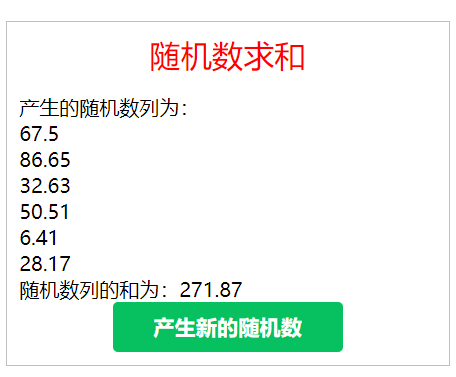

1. 实现页面

```html
<!--index.wxml-->
<view class="box">
  <view class="title">随机数求和</view>
  <view>产生的随机数列为：</view>
  <view wx:for="{{rand}}">{{item}}</view>
  <view>随机数列的和为：{{sum}}</view>
  <button type="primary" bindtap="newRand">产生新的随机数</button>
</view>
```

2. 实现逻辑

```css
// index.js
var rand, sum;

function createRand() {
  rand = []
  sum = 0;
  for(var i = 0; i < 6; i++) {
    var r = (Math.random() * 100).toFixed(2) * 1;
    rand.push(r);
    sum += rand[i];
    console.log(rand[i]);
  }
  console.log(sum);
}

Page({
  onLoad: function() {
    createRand();
    this.setData({
      rand: rand,
      sum: sum
    })
  },

  newRand: function() {
    createRand();
    this.setData({
      rand: rand,
      sum: sum
    })
  }
})
```

对象时拥有属性和方法的数据，属性是静态数据，方法是能够在对象上执行的动作，即动态数据。

JavaScript中的常用对象包括：字符串、数字、数组、日期等。

`Array`对象：用于在单个的变量中存储多个值。

| 属性和方法 | 说明                                                         |
| ---------- | ------------------------------------------------------------ |
| length     | 设置或返回数组中元素的个数                                   |
| concat()   | 连接两个或更多的数组，并返回结果                             |
| join()     | 把数组的所有元素放入一个字符串，元素通过指定的分隔符进行分隔 |
| pop()      | 删除并返回数组的最后一个元素                                 |
| push()     | 向数组的添加一个或多个元素，并返回新的长度                   |
| reverse()  | 使数组中的元素反序                                           |
| shift()    | 删除并返回数组的第一个元素                                   |

`Number`对象：该对象是原始数值的包装对象。

| 属性和方法        | 说明                                               |
| ----------------- | -------------------------------------------------- |
| MAX_VALUE         | 可表示的最大数                                     |
| MIN_VALUE         | 可表示的最小数                                     |
| NaN               | 非数字值                                           |
| NEGATIVE_INFINITY | 负无穷大，溢出时返回该值                           |
| POSITIVE_INFINITY | 正无穷大，溢出时返回该值                           |
| toString()        | 把数值转换为字符串，使用指定的基数                 |
| toLocaleString()  | 把数值转换为字符串，使用本地数字格式熟顺序         |
| toFixed()         | 把数值转换为字符串，结果的小数点后有指定位数的数字 |
| toExponential()   | 把对象的值转换为指数计数法                         |
| toPrecision()     | 把数值格式化为指定的长度                           |
| valueOf()         | 返回一个Number对象的基本数字值                     |

<div STYLE="page-break-after: always;"></div>

### 2.13 计时器

设计一个实现倒计时功能的小程序，小程序执行后，首先显示空白界面，过2秒后才显示计时界面，点击“开始计时”按钮后开始倒计时，点击“停止计时”按钮后停止计时。

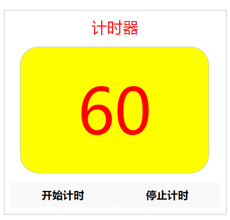

```html
<!--index.wxml-->
<view class="box" hidden="{{hidden}}">
  <view class="title">计时器</view>
  <view class="time">{{num}}</view>
  <view class="btnLayout">
    <button bindtap="start">开始计时</button>
    <button bindtap="stop">停止计时</button>
  </view>
</view>
```

```css
/**index.wxss**/
.time {
  width: 90%;
  line-height: 200px;
  background-color: yellow;
  color: red;
  font-size: 100px;
  text-align: center;
  border: 1px solid silver;
  border-radius: 30px;
  margin: 15px;
}

.btnLayout {
  display: flex;
  flex-direction: row;
}

button {
  width: 45%;
}
```

```js
// index.js
var num = 60;
var timerID;

Page({
  data: {
    hidden: true,
    num: num
  },

  onLoad: function(options) {
    var that = this;
    setTimeout(() => {
      that.show()
    }, 2000)
  },

  show: function() {
    var that = this;
    that.setData({
      hidden: false
    })
  },

  start: function() {
    var that = this;
    timerID = setInterval(() => {
      that.timer()
    }, 1000);
  },

  stop: function() {
    clearInterval(timerID);
  },

  timer: function() {
    var that = this;
    console.log(num);
    if(num > 0) {
      that.setData({
        num: num--
      })
    } else {
      that.setData({
        num: 0
      })
    }
    console.log(num);
  }
})
```

`number setTimeout(function callback, number delay, any rest)`：设定一个计时器，在计时到期以后执行注册的回调函数。

`clearTimeout(number timeoutID)`：取消由`setTimeout()`设置的计时器。参数`timeoutID`为要取消的计时器的ID。

`number setInterval(function callback, number delay, any rest)`：设定一个计时器，按照指定的周期（以毫秒计）来执行注册的回调函数。

`clearInterval(number intervalID)`：取消由`setInterval()`设置的计时器。参数`intervalID`为要取消的计时器的ID。

<div STYLE="page-break-after: always;"></div>

### 2.14 自动随机变化的三色旗

设计一个小程序，开始时界面上显示一个三色旗和一个按钮，当点击按钮时，三色旗的颜色会发生随机变化，即使不点击按钮，三色旗的颜色也会每隔一定时间发生变化。

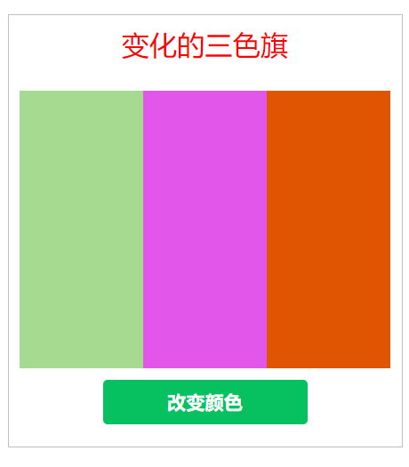

```html
<!--index.wxml-->
<view class="box">
  <view class="title">变化的三色旗</view>
  <view class="flex-wrp">
    <view class="item" style="background-color: {{color1}};"></view>
    <view class="item" style="background-color: {{color2}};"></view>
    <view class="item" style="background-color: {{color3}};"></view>
  </view>
  <button type="primary" class="btn" bindtap="createColor">改变颜色</button>
</view>
```

```css
/**index.wxss**/
.flex-wrp {
  margin-top: 50rpx;
  display: flex;
  flex-direction: row;
}

.item {
  width: 300rpx;
  height: 500rpx;
}

.btn {
  margin-top: 20rpx;
  margin-bottom: 20rpx;
}
```

```js
// index.js
Page({
  createColor: function() {
    var color = [];
    var letters = '0123456789ABCDEF';
    for(var i = 0; i < 3; i++) {
      var c = '#';
      for(var j = 0; j < 6; j++) {
        c += letters[Math.floor(Math.random() * 16)];
      }
      color.push(c);
    }
    console.log(color);

    this.setData({
      color1: color[0],
      color2: color[1],
      color3: color[2]
    })
  },

  onLoad: function(e) {
    this.createColor();
    setInterval(() => {
      this.createColor();
    }, 5000);
  }
})
```

<div STYLE="page-break-after: always;"></div>

## 第3章 小程序架构

### 3.1 小程序的基本架构

创建一个包含：首页、教学、科研、咨询和关于我们5个标签的小程序，每个标签都有对应的页面、图标和标签文字，点击某个标签将切换到对应的页面，同时该标签的图标和文字颜色都会发生变化，页面的标题也发生相应的变化，而其它标签则变为非选中状态。

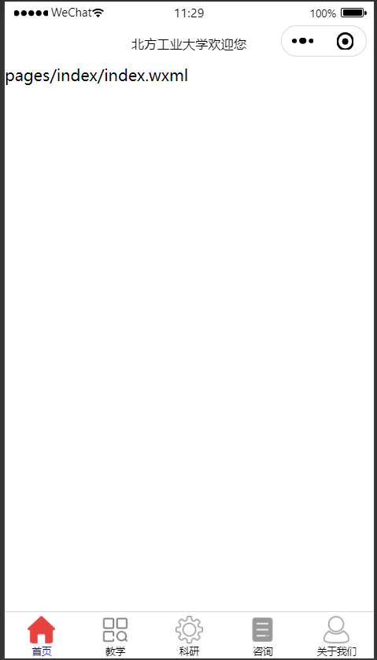

1. 添加图片资源到`images`目录
2. 在`app.json`中添加配置信息

```json
{
  "pages":[
    "pages/index/index",
    "pages/jiaoxue/jiaoxue",
    "pages/keyan/keyan",
    "pages/zixun/zixun",
    "pages/guanyu/guanyu"
  ],
  "window":{
    "navigationBarBackgroundColor": "#fff",
    "navigationBarTitleText": "北方工业大学欢迎您",
    "navigationBarTextStyle":"black"
  },
  "tabBar": {
    "color": "#000",
    "selectedColor": "#00f",
    "list": [
      {
        "pagePath": "pages/index/index",
        "text": "首页",
        "iconPath": "/images/home-off.png",
        "selectedIconPath": "/images/home-on.png"
      },
      {
        "pagePath": "pages/jiaoxue/jiaoxue",
        "text": "教学",
        "iconPath": "/images/fuwu-off.png",
        "selectedIconPath": "/images/fuwu-on.png"
      },
      {
        "pagePath": "pages/keyan/keyan",
        "text": "科研",
        "iconPath": "/images/settings-outline.png",
        "selectedIconPath": "/images/settings-selected.png"
      },
      {
        "pagePath": "pages/zixun/zixun",
        "text": "咨询",
        "iconPath": "/images/news-off.png",
        "selectedIconPath": "/images/new-on.png"
      },
      {
        "pagePath": "pages/guanyu/guanyu",
        "text": "关于我们",
        "iconPath": "/images/API-off.png",
        "selectedIconPath": "/images/API-on.png"
      }
    ]
  }
}
```

3. 为每个页面的`.json`文件单独配置

```json
{
  "navigationBarBackgroundColor": "#ff0000",
  "navigationBarTextStyle": "white",
  "navigationBarTitleText": "教学"
}
```

```json
{
  "navigationBarTitleText": "科研"
}
```

```json
{
  "navigationBarTitleText": "咨询"
}
```

```json
{
  "navigationBarTitleText": "关于我们"
}
```

利用`app.json`文件对小程序进行全局配置。

利用`同名.json`文件对本页面窗口表现进行配置。

- `app.json`文件属性

| 属性           | 类型     | 必填 | 描述                        |
| -------------- | -------- | ---- | --------------------------- |
| pages          | string[] | 是   | 页面路径列表                |
| window         | Object   | 否   | 全局的默认窗口表现          |
| tarBar         | Object   | 否   | 底部tab栏的表现             |
| networkTimeout | Object   | 否   | 网络超时时间                |
| debug          | boolean  | 否   | 是否开始debug模式，默认关闭 |
| permission     | Object   | 否   | 小程序接口权限相关设置      |

- Pages配置

pages用于指定小程序由哪些页面组成，每一项都对应一个页面的路径（含文件名）信息。文件名不需要写文件后缀，框架会自动去寻找对应位置的`.json`、`.js`、`.wxml`、`.wxss`四个文件进行处理。数组的第一项代表小程序的初始页面（首页）。小程序中新增/减少页面，都需要对pages数组进行修改。

- Window配置

| 属性                         | 类型     | 描述                                      |
| ---------------------------- | -------- | ----------------------------------------- |
| navigationBarBackgroundColor | HexColor | 导航栏背景颜色，如 #000000                |
| navigationBarTextStyle       | string   | 导航栏标题颜色，仅支持black/white         |
| navigationBarTitleText       | string   | 导航栏标题文字内容                        |
| backgroundColor              | HexColor | 窗口的背景色                              |
| backgroundTextStyle          | string   | 下拉loading的样式，仅支持dark/light       |
| pageOrientation              | string   | 屏幕旋转设置，支持auto/portrait/landscape |

- tabBar配置

| 属性            | 类型     | 描述                                  |
| --------------- | -------- | ------------------------------------- |
| color           | HexColor | tab上的文字的默认颜色                 |
| selectedColor   | HexColor | tab上选中文字的颜色                   |
| backgroundColor | HexColor | tab的背景色                           |
| borderStyle     | string   | tabBar上边框的颜色，仅支持black/white |
| list            | Array    | tab列表，最少2个，最多5个tab          |
| position        | string   | tabBar的位置，仅支持bottom/top        |

- list配置

| 属性             | 类型   | 必填 | 说明                                                         |
| ---------------- | ------ | ---- | ------------------------------------------------------------ |
| pagePath         | string | 是   | 页面路径，必须在pages中先定义                                |
| text             | string | 是   | tab上按钮文字                                                |
| iconPath         | string | 否   | 图片路径，icon大小限制为40kb，建议尺寸为81px*81px，不支持网络图片 |
| selectedIconPath | string | 否   | 选中时的图片路径                                             |

<div STYLE="page-break-after: always;"></div>

### 3.2 小程序的执行顺序

设计一个带有多标签页面小程序，测试小程序各个页面和函数的执行顺序。

```js
// app.js
App({
  onLaunch: function() {
    console.log("app.js -- onLaunch -- 小程序初始化");
  },

  onShow: function() {
    console.log("app.js -- onShow -- 小程序显示");
  },

  onHide: function() {
    console.log("app.js -- onHide -- 小程序隐藏");
  }
})
```

```js
// index.js
Page({
  onLoad: function() {
    console.log("index.js -- onLoad -- 页面加载");
  },

  onShow: function() {
    console.log("index.js -- onShow -- 页面显示");
  },

  onReady: function() {
    console.log("index.js -- onReady -- 页面初次渲染完成");
  },

  onHide: function() {
    console.log("index.js -- onHide -- 页面隐藏");
  }
})
```

```js
// pages/jiaoxue/jiaoxue.js
Page({
  onLoad: function () {
    console.log("jiaoxue.js -- onLoad -- 页面加载");
  },

  onShow: function () {
    console.log("jiaoxue.js -- onShow -- 页面显示");
  },

  onReady: function () {
    console.log("jiaoxue.js -- onReady -- 页面初次渲染完成");
  },

  onHide: function () {
    console.log("jiaoxue.js -- onHide -- 页面隐藏");
  }
})
```

`App(Object object)`函数：用于注册小程序，该函数必须在`app.js`中调用，必须调用且只能调用一次。

| 属性           | 类型     | 说明                                                       |
| -------------- | -------- | ---------------------------------------------------------- |
| onLaunch       | function | 生命周期回调函数，监听小程序初始化                         |
| onShow         | function | 生命周期回调函数，监听小程序启动或切前台                   |
| onHide         | function | 生命周期回调函数，监听小程序切后台                         |
| onError        | function | 错误监听函数                                               |
| onPageNotFound | function | 页面不存在监听函数                                         |
| 其它           | any      | 开发者可以添加任意函数或数据变量到Object参数中，用this访问 |

`Page(Object object)`函数：用于注册小程序中的页面，其参数object用于指定页面的初始坏数据、生命周期回调、事件处理函数等。

| 属性     | 类型     | 说明                                                         |
| -------- | -------- | ------------------------------------------------------------ |
| data     | Object   | 页面的初始数据                                               |
| onLoad   | function | 生命周期回调函数，监听页面加载                               |
| onShow   | function | 生命周期回调函数，监听页面显示                               |
| onReady  | function | 生命周期回调函数，监听页面初次渲染完成                       |
| onHide   | function | 生命周期回调函数，监听页面隐藏                               |
| onUnload | function | 生命周期回调函数，监听页面卸载                               |
| 其它     | any      | 开发者可以添加任意函数或数据变量到Object参数中，在页面的函数中用this访问 |

<div STYLE="page-break-after: always;"></div>

### 3.3 数据及事件绑定

编写一个小程序，实现数据和事件的绑定。数据绑定包括：算术运算绑定、对象绑定和数据绑定，并通过点击按钮事件修改绑定的数据。

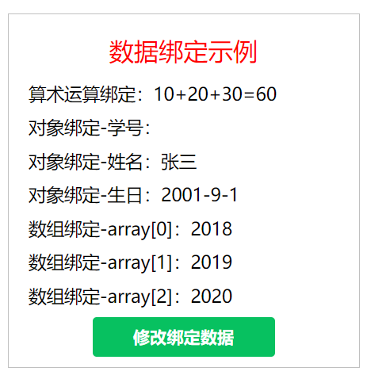

```html
<!--index.wxml-->
<view class="box">
  <view class="title">数据绑定示例</view>
  <view>算术运算绑定：{{a}}+{{b}}+{{c}}={{a+b+c}}</view>
  <view>对象绑定-学号：{{Student.stuId}}</view>
  <view>对象绑定-姓名：{{Student.name}}</view>
  <view>对象绑定-生日：{{Student.birthday}}</view>
  <view>数组绑定-array[0]：{{array[0]}}</view>
  <view>数组绑定-array[1]：{{array[1]}}</view>
  <view>数组绑定-array[2]：{{array[2]}}</view>
  <button type="primary" bindtap="modify">修改绑定数据</button>
</view>
```

```css
/**index.wxss**/
view {
  font-size: 18px;
  margin: 10px;
}
```

```js
// index.js
Page({
  data: {
    a: 10,
    b: 20,
    c: 30,
    Student: {
      stuID: "20190213",
      name: "张三",
      birthday: "2001-9-1"
    },
    array: [
      "2018", "2019", "2020"
    ]
  },

  modify: function() {
    this.setData({
      a: 100,
      b: 200,
      c: 300,
      Student: {
        stuID: "20190213",
        name: "李四",
        birthday: "2001-9-1"
      },
      array: [
        "2028", "2029", "2030"
      ]
    })
  }
})
```

<div STYLE="page-break-after: always;"></div>

### 3.4 变量和函数的作用域及模块化

设计一个小程序，在`index.js`文件中调用其它文件及本文件中定义的变量和函数，从而实现对全局变量和函数、本文件定义的变量和函数以及其它模块中定义的变量和函数的引用。

1. 实现界面

```html
<!--index.wxml-->
<view class="box">
  <view class="title">变量模块化示例</view>
  <view>全局变量：{{msg1}}</view>
  <view>全局函数：{{msg2}}</view>
  <view>本文件变量：{{msg3}}</view>
  <view>本文件函数：{{msg4}}</view>
  <view>其它模块变量：{{msg5}}</view>
  <view>其它模块函数：{{msg6}}</view>
</view>
```

2. 在`pages`目录下创建`utils`目录，在`utils`目录下再创建`util.js`文件。
3. 实现样式

```css
/**index.wxss**/
view {
  font-size: 18px;
  margin: 10px;
}
```

4. 编写变量和函数

```js
// index.js
const app = getApp(); // 获取全局应用实例
var util = require("../utils/util.js") // 获取utils模块应用实例、

var indexMsg = "我是来自index.js的变量"; // 定义本模块的变量

// 定义本模块的函数
function indexFunc() {
  return "我是来自index.js的函数";
}

Page({
  data: {
    msg1: app.globalMsg, // 使用全局变量
    msg2: app.globalFunc(), // 使用全局函数
    msg3: indexMsg, // 使用本模块变量
    msg4: indexFunc(), // 使用本模块函数
    msg5: util.utilMsg, // 使用utils模块变量
    msg6: util.utilFunc() // 使用utils模块函数
  }
})
```

```js
// app.js
App({
  globalMsg: "我是来自app.js的全局变量",
  globalFunc: function() {
    return "我是来自app.js的全局函数";
  }
})
```

```js
// util.js

var utilMsg = "我是来自util.js的变量";

function utilFunc() {
  return "我是来自util.js的函数";
}

module.exports = {
  utilMsg: utilMsg,
  utilFunc: utilFunc
}
```

在JavaScript文件中声明的变量和函数只在该文件中有效；不同文件中额可以声明相同名字的变量和函数，不会互相影响。通过全局函数`getApp()`可以获取全局的应用实例，如果需要全局的数据，可以在`App()`中设置。

可以将一些公共的代码抽离成为一个单独的`js`文件作为一个模块。模块通过`module.exports`或者`exports`对外暴露接口，在需要这些模块的文件中，使用`require(path)`将公共代码引入（path为相对路径，暂时不支持绝对路径）。

<div STYLE="page-break-after: always;"></div>

### 3.5 条件渲染

编写一个利用`wx:if`实现颜色显示的小程序。当`wx:if`放在`view`中通过`js`文件传递一种颜色时，窗口将显示该颜色名称和颜色。当`wx:if`放在`block`中并传递给变量`length`的值大于10时，将在窗口下方显示红、绿、蓝三种颜色条，否则将不显示。

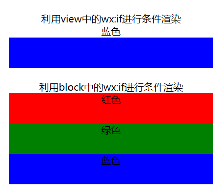

```html
<!--index.wxml-->
<view style="margin: 20px; text-align: center;">
  利用view中的wx:if进行条件渲染
  <view wx:if="{{color=='red'}}">红色</view>
  <view wx:elif="{{color=='green'}}">绿色</view>
  <view wx:elif="{{color=='blue'}}">蓝色</view>
  <view wx:else>其它颜色</view>
  <view class="view-item" style="background-color: {{color}};"></view>
</view>

<view style="margin: 20px; text-align: center;">
  利用block中的wx:if进行条件渲染
  <block wx:if="{{length > 10}}">
    <view class="view-item bc-red">红色</view>
    <view class="view-item bc-green">绿色</view>
    <view class="view-item bc-blue">蓝色</view>
  </block>
</view>
```

```css
/**index.wxss**/
.view-item {
  width: 100%;
  height: 50px;
}

.bc-red {
  background-color: red;
}

.bc-green {
  background-color: green;
}

.bc-blue {
  background-color: blue;
}
```

```js
// index.js
Page({
  data: {
    color: "blue",
    length: 15
  }
})
```

<div STYLE="page-break-after: always;"></div>

### 3.6 成绩等级计算器

编写一个小程序，输入成绩后显示成绩等级，如果输入成绩大于100或者小于0，则显示“成绩输入有误”的提示。

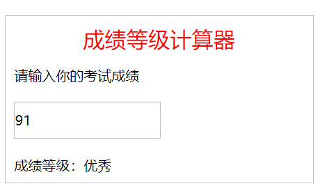

```html
<!--index.wxml-->
<view class="box">
  <view class="title">成绩等级计算器</view>

  <view>请输入你的考试成绩</view>
  <input bindblur="scoreInput" placeholder="在此输入成绩"/>
  <view wx:if="{{score > 100 || score < 0}}">成绩输入有误！</view>
  <view wx:elif="{{score > 90}}">成绩等级：优秀</view>
  <view wx:elif="{{score > 80}}">成绩等级：良好</view>
  <view wx:elif="{{score > 70}}">成绩等级：中等</view>
  <view wx:elif="{{score > 60}}">成绩等级：及格</view>
  <view wx:else>成绩等级：不及格</view>
</view>
```

```css
/**index.wxss**/
input {
  margin-top: 20px;
  margin-bottom: 20px;
  width: 50%;
  height: 80rpx;
  border: 1px solid silver;
}
```

```js
// index.js
Page({
  data: {
    score: 0
  },

  scoreInput: function(e) {
    this.setData({
      score: e.detail.value
    })
  }
})
```

<div STYLE="page-break-after: always;"></div>

### 3.7 列表渲染

编写一个小程序，利用`wx:for`实现对数组、对象以及字符串的列表渲染，利用`wx:for-index`和`wx:for-item`实现对index和item的重命名，在block中使用`wx:for`实现对多节点结构的渲染。

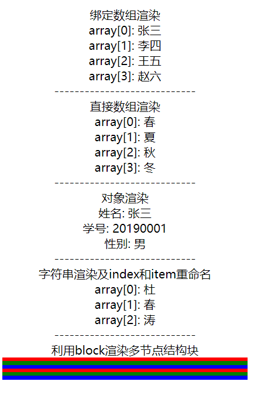

```html
<!--index.wxml-->
<view style="margin: 20px; text-align: center">
  <view>绑定数组渲染</view>
  <view wx:for="{{array}}">
    array[{{index}}]: {{item}}
  </view>
  ----------------------------
  <view>直接数组渲染</view>
  <view wx:for="{{['春', '夏', '秋', '冬']}}">
    array[{{index}}]: {{item}}
  </view>
  ----------------------------
  <view>对象渲染</view>
  <view wx:for="{{object}}">
    {{index}}: {{item}}
  </view>
  ----------------------------
  <view>字符串渲染及index和item重命名</view>
  <view wx:for="杜春涛" wx:for-index="i" wx:for-item="j">
    array[{{i}}]: {{j}}
  </view>
  ----------------------------
  <view>利用block渲染多节点结构块</view>
  <block wx:for="{{[1,2]}}">
    <view class="view-item bc-red"></view>
    <view class="view-item bc-green"></view>
    <view class="view-item bc-blue"></view>
  </block>
</view>
```

```css
/**index.wxss**/
.view-item {
  width: 100%;
  height: 5px;
}

.bc-red {
  background-color: red;
}

.bc-green {
  background-color: green;
}

.bc-blue {
  background-color: blue;
}
```

```js
// index.js
Page({
  data: {
    array: ["张三", "李四", "王五", "赵六",],
    object: {
      姓名: "张三",
      学号: "20190001",
      性别: "男"
    }
  }
})
```

在组件上使用`wx:for`控制属性绑定一个数组，即可使用数组中各项的数据重复渲染该组件。

数组当前项的下标变量默认为`index`，数组当前项的变量名默认为`item`。使用`wx:for-item`和`wx:for-index`可以指定数组当前元素和元素下标。可以将`wx:for`用在`<block>`标签上，以渲染一个包含多节点的结构块。

如果列表元素位置会动态改变或者有新的元素添加，并且希望列表中的项目保持自己的特征和状态，就需要使用`wx:key`来指定列表中元素的唯一标识符。

<div STYLE="page-break-after: always;"></div>

### 3.8 九九乘法表

编写一个小程序，综合运用`wx:if`条件渲染和`wx:for`列表渲染在视图层打印一个九九乘法表。

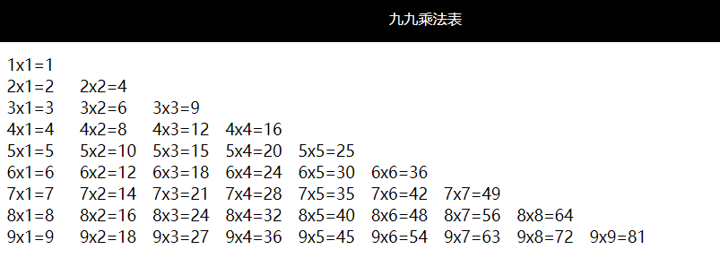

```html
<!--index.wxml-->
<view class="con">
  <view wx:for="{{[1,2,3,4,5,6,7,8,9]}}" wx:for-item="i">
    <view class="inline" wx:for="{{[1,2,3,4,5,6,7,8,9]}}" wx:for-item="j">
      <view wx:if="{{j<=i}}">
        {{i}}x{{j}}={{i*j}}
      </view>
    </view>
  </view>
</view>
```

```css
/**index.wxss**/
.con {
  font-size: 14px;
  margin: 10px;
}

.inline {
  display: inline-block;
  width: 65px;
}
```

```json
{
  "navigationBarBackgroundColor": "#000000",
  "navigationBarTitleText": "九九乘法表",
  "navigationBarTextStyle": "white",
  "backgroundTextStyle": "dark"
}
```

`inline-block`：既拥有了`block`，元素可以设置`width`和`height`的特性，又保持了`inline`元素不换行的特性。

<div STYLE="page-break-after: always;"></div>

### 3.9 模板的定义及引用

编写一个小程序，首先定义1个模板，其中包含1个学生的姓名、年龄和性别等信息，然后使用该模板创建3个学生。

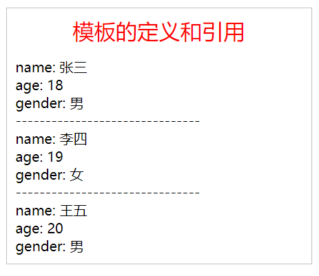

1. 在`pages/index`目录下新建`template.wxml`

```html
<!-- template.wxml -->
<template name="student">
  <view>name: {{name}}</view>
  <view>age: {{age}}</view>
  <view>gender: {{gender}}</view>
</template>
```

2. 创建2个student

```js
// index.js
Page({
  data: {
    stu01: {
      name: "张三",
      age: 18,
      gender: "男"
    },
    stu02: {
      name: "李四",
      age: 19,
      gender: "女"
    }
  }
})
```

3. 引用模板

```html
<!--index.wxml-->
<view class="box">
  <view class="title">模板的定义和引用</view>
  <import src="template.wxml"/>

  <template is="student" data="{{...stu01}}"/>
  -------------------------------
  <template is="student" data="{{...stu02}}"/>
  -------------------------------
  <template is="student" data="{{name: '王五', age: 20, gender: '男'}}"/>
</view>
```

WXML提供模板（template），可以在模板中定义代码片段，然后在不同的地方引用。

定义模板时，使用`name`属性指定模板的名字；引用模板时，使用`is`属性指定引用的模板，并通过`data`属性传入模板数据。

利用`import`可以引用目标文件中定义的template，import有作用域的概念，即只会import目标文件import的template。

<div STYLE="page-break-after: always;"></div>

### 3.10 利用include引用文件

设计一个小程序，在项目中添加文件`header.wxml`和`footer.wxml`，然后在`index.wxml`文件中利用include引用这2个文件，作为index页面的头部和尾部内容。

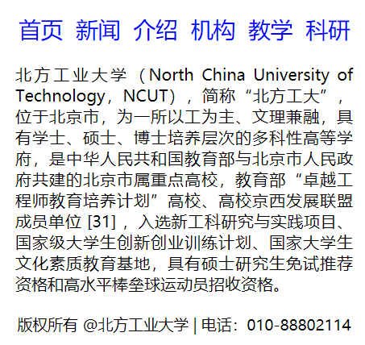

1. 创建`header.wxml`和`footer.wxml`

```html
<view class="header">
  <view>首页</view>
  <view>新闻</view>
  <view>介绍</view>
  <view>机构</view>
  <view>教学</view>
  <view>科研</view>
</view>
```

```html
<view class="footer" style="height: 100px">
  版权所有 @北方工业大学 | 电话：010-88802114
</view>
```

2. 引入模板

```html
<!--index.wxml-->
<include src="header.wxml"/>
<view style="margin: 20px; text-align: justify;">
  北方工业大学（North China University of Technology，NCUT），简称“北方工大”，位于北京市，为一所以工为主、文理兼融，具有学士、硕士、博士培养层次的多科性高等学府，是中华人民共和国教育部与北京市人民政府共建的北京市属重点高校，教育部“卓越工程师教育培养计划”高校、高校京西发展联盟成员单位 [31]  ，入选新工科研究与实践项目、国家级大学生创新创业训练计划、国家大学生文化素质教育基地，具有硕士研究生免试推荐资格和高水平棒垒球运动员招收资格。
</view>
<include src="footer.wxml"/>
```

3. 样式

```css
/**index.wxss**/
.header {
  margin: 20rpx;
  color: blue;
  font-size: 22px;
  display: flex;
  flex-direction: row;
  justify-content: space-evenly;
}

.footer {
  margin: 20rpx;
  font-size: 15px;
  text-align: center;
}
```

WXML提供两种文件引用方式：`import`和`include`。`import`只能引用文件中的template，而通过`include`可以引用文件中除了`<template>`和`<wxs>`之外的整个代码，相当于将目标文件中的代码拷贝到include位置。

<div STYLE="page-break-after: always;"></div>

## 第4章 小程序组件

### 4.1 货币兑换

设计一个小程序，实现人民币与其它货币之间的兑换。当输入人民币的数值后，能够显示其它货币对应的金额。

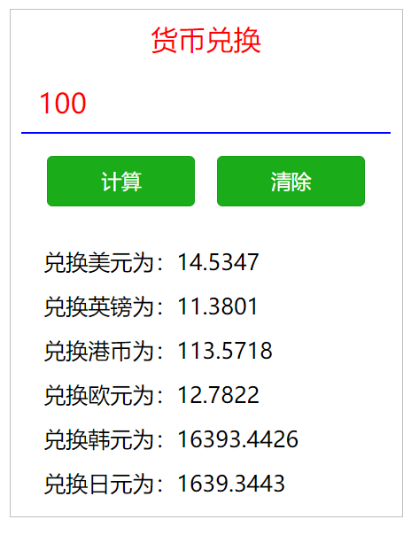

```html
<!--pages/4_1/4_1.wxml-->
<view class="box">
  <view class="title">货币兑换</view>

  <form bindsubmit="calc" bindreset="reset">
    <input name="cels" placeholder="请输入人民币金额" type="number" auto-focus="true"/>
    
    <view class="btnLayout">
      <button type="primary" form-type="submit">计算</button>
      <button type="primary" form-type="reset">清除</button>
    </view>

    <view class="textLayout">
      <text>兑换美元为：{{M}}</text>
      <text>兑换英镑为：{{Y}}</text>
      <text>兑换港币为：{{G}}</text>
      <text>兑换欧元为：{{O}}</text>
      <text>兑换韩元为：{{H}}</text>
      <text>兑换日元为：{{R}}</text>
    </view>
  </form>
</view>
```

```css
/* pages/4_1/4_1.wxss */
input {
  border-bottom: 2px solid blue;
  margin: 10px 0;
  font-size: 25px;
  color: red;
  padding: 15px;
}

button {
  width: 40%;
  margin: 10px;
}

.btnLayout {
  display: flex;
  flex-direction: row;
  justify-content: center;  /* 沿主轴方向居中对齐 */
}

.textLayout {
  display: flex;
  flex-direction: column;
  align-items: flex-start;  /* 沿交叉轴方向向左对齐 */
  font-size: 20px;
  margin-top: 20px;
  margin-left: 20px;
  line-height: 40px;
}
```

```js
// pages/4_1/4_1.js

var C; // 人民币

Page({
  calc: function (e) {
    C = parseInt(e.detail.value.cels);
    this.setData({
      M: (C / 6.8801).toFixed(4),
      Y: (C / 8.7873).toFixed(4),
      G: (C / 0.8805).toFixed(4),
      O: (C / 7.8234).toFixed(4),
      H: (C / 0.0061).toFixed(4),
      R: (C / 0.0610).toFixed(4),
    })
  },

  reset: function() {
    this.setData({
      M: '',
      Y: '',
      G: '',
      O: '',
      H: '',
      R: '',
    })
  }
})
```

`form`组件：用于提交内部组件`switch`、`input`、`checkbox`、`slider`、`radio`、`picker`的用户输入。

获取`form`内各组件`value`值的方法：当点击`form`表单中`form-type`为`submit`的`button`组件时，会将表单内各组件的`value`值提交。（注意：需要设置表单内各组件的`name`属性）。

<div STYLE="page-break-after: always;"></div>

### 4.2 三角形面积计算器

设计一个根据三角形的三条边长求三角形面积的微信小程序。计算公式如下：
$$
area = \sqrt{s * (s-a) * (s-b) * (s-c)}
$$
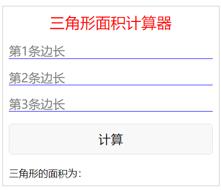

```html
<!--pages/4_2/4_2.wxml-->
<view class="box">
  <view class="title">三角形面积计算器</view>

  <form bindsubmit="formSubmit">
    <input type="digit" placeholder="第1条边长" name="a" value="{{a}}"/>
    <input type="digit" placeholder="第2条边长" name="b" value="{{b}}"/>
    <input type="digit" placeholder="第3条边长" name="c" value="{{c}}"/>
    <button form-type="submit">计算</button>
  </form>

  <view>三角形的面积为：{{result}}</view>
</view>
```

```css
/* pages/4_2/4_2.wxss */
input, button, text {
  font-size: 20px;
  margin: 20px 0;
}

input {
  border-bottom: 1px solid blue;
}
```

```js
// pages/4_2/4_2.js
Page({
  formSubmit: function (e) {
    var a = parseFloat(e.detail.value.a);
    var b = parseFloat(e.detail.value.b);
    var c = parseFloat(e.detail.value.c);

    var area;
    if (a + b <= c || a + c <= b || b + c <= a) {
      wx.showToast({
        title: '三角形的两边之和小于第三边！', // 对话框标题
        icon: "none", // 对话框图标
        duration: 2000, // 对话框显示时长
      });
      this.clear(); // 调用函数清空input组件中的数据
      return;
    } else {
      var s = (a + b + c) / 2;
      area = Math.sqrt(s * (s - a) * (s - b) * (s - c));
    }

    this.setData({
      result: area
    });
  },

  clear: function() {
    this.setData({
      a: "",
      b: "",
      c: "",
      result: ""
    })
  }
})
```

消息提示框API函数：

`wx.showToast(Object object)`

| 属性     | 说明                                        |
| -------- | ------------------------------------------- |
| title    | 提示的内容                                  |
| icon     | 图标                                        |
| image    | 自定义图标的本地路径，image的优先级高于icon |
| duration | 延迟时间                                    |
| mask     | 是否显示透明蒙层，防止触摸穿透              |
| success  | 接口调用成功的回调函数                      |
| fail     | 接口调用失败的回调函数                      |
| complete | 接口调用结束的回调函数                      |

`wx.showModal(Object object)`

`wx.showLoading(Object object)`

`wx.hideToast(Object object)`

`wx.hideLoading(Object object)`

<div STYLE="page-break-after: always;"></div>

### 4.3 设置字体样式和大小

编写一个小程序，利用`radio`组件改变字体类型，利用`checkbox`组件改变字体加粗、倾斜和下划线等样式。

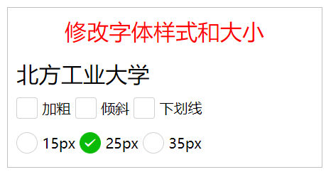

```html
<!--pages/4_3/4_3.wxml-->
<view class="box">
  <view class="title">修改字体样式和大小</view>

  <text style="font-weight: {{myBold}}; font-style: {{myItalic}}; text-decoration: {{myUnderline}}; font-size: {{myFontSize}};">北方工业大学</text>

  <checkbox-group bindchange="checkboxChange">
    <checkbox value="isBold">加粗</checkbox>
    <checkbox value="myItalic">倾斜</checkbox>
    <checkbox value="myUnderline">下划线</checkbox>
  </checkbox-group>

  <radio-group bindchange="radioChange">
    <radio value="15px">15px</radio>
    <radio value="25px" checked="true">25px</radio>
    <radio value="35px">35px</radio>
  </radio-group>
</view>
```

```css
/* pages/4_3/4_3.wxss */
radio, checkbox {
  margin-top: 20rpx;
  margin-bottom: 10rpx;
  margin-right: 10rpx;
}
```

```js
// pages/4_3/4_3.js
Page({
  data: {
    myFontSize: "25px"
  },

  checkboxChange: function(e) {
    var text = [];
    var mybold = "";
    var myitalic = "";
    var myunderline = ""

    text = e.detail.value;

    for(var i = 0; i < text.length; i++) {
      if(text[i] == "isBold") {
        mybold = "bold";
      }
      if(text[i] == "isItalic") {
        myitalic = "italic";
      }
      if(text[i] == "isUnderline") {
        myunderline = "underline";
      }
    }

    this.setData({
      myBold: mybold,
      myItalic: myitalic,
      myUnderline: myunderline
    })

    console.log(text);
  },

  radioChange: function(e) {
    this.setData({
      myFontSize: e.detail.value
    })
    console.log(e.detail.value)
  }
})
```

`radio`组件

| 属性     | 说明                                                         |
| -------- | ------------------------------------------------------------ |
| value    | radio标识，当radio选中时，radio-group的change时间会携带radio的value |
| checked  | 当前是否选中                                                 |
| disabled | 是否禁用                                                     |
| color    | radio的颜色                                                  |

`radio-group`组件

| 属性       | 说明                                        |
| ---------- | ------------------------------------------- |
| bindchange | radio-group中选中项发生改变时触发change事件 |

`checkbox`为多选项目组件，它必须和`checkbox-group`多项选择器组件一起使用。`checkbox-group`内部由多个`checkbox`组成。

`checkbox`组件

| 属性     | 说明                             |
| -------- | -------------------------------- |
| value    | checkbox标识                     |
| disabled | 是否禁用                         |
| checked  | 当前是否选中，可用来设置默认选中 |
| color    | checkbox的颜色                   |

`checkbox-group`组件

| 属性       | 说明                                           |
| ---------- | ---------------------------------------------- |
| bindchange | checkbox-group中选中项发生改变时触发change事件 |

<div STYLE="page-break-after: always;"></div>

### 4.4 滑动条和颜色

编写一个小程序，利用`slider`滑动条组件控制颜色的变化。

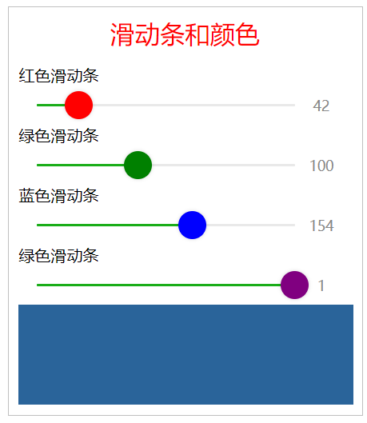

```html
<!--pages/4_4/4_4.wxml-->
<view class="box">
  <view class="title">滑动条和颜色</view>

  <text>红色滑动条</text>
  <slider data-color="r" value="{{r}}" max="255" block-color="red" show-value="true" bindchanging="colorChanging"/>

  <text>绿色滑动条</text>
  <slider data-color="g" value="{{g}}" max="255" block-color="green" show-value="true" bindchanging="colorChanging"/>

  <text>蓝色滑动条</text>
  <slider data-color="b" value="{{b}}" max="255" block-color="blue" show-value="true" bindchanging="colorChanging"/>

  <text>透明滑动条</text>
  <slider data-color="a" value="{{a}}" max="1" step="0.01" block-color="purple" show-value="true" bindchanging="colorChanging"/>

  <view class="colorArea" style="background-color: rgba({{r}}, {{g}}, {{b}}, {{a}});"></view>
</view>
```

```css
/* pages/4_4/4_4.wxss */
.colorArea {
  width: 335px;
  height: 100px;
}
```

```js
// pages/4_4/4_4.js
Page({
  data: {
    r: 50,
    g: 100,
    b: 150,
    a: 1
  },

  colorChanging(e) {
    let color = e.currentTarget.dataset.color;  // 获取当前slider组件的data-color值
    let value = e.detail.value;   // 获取当前slider组件的value值
    console.log(color, value);

    if(color == "r") {
      this.setData({
        r: value  // 将value值赋值给数组color
      })
    }

    this.setData({
      [color]: value  // 将value值赋值给数组color
    })
  }
})
```

`slider`是滑动选择器组件，通过滑动该组件来改变滑块位置。

| 属性名          | 说明                                         |
| --------------- | -------------------------------------------- |
| min             | 最小值                                       |
| max             | 最大值                                       |
| step            | 步长，取值必须大于0，并且可被(max - min)整除 |
| value           | 当前取值                                     |
| activeColor     | 已选择的颜色                                 |
| backgroundColor | 背景条的颜色                                 |
| block-size      | 滑块的大小，取值范围为12 - 28                |
| block-color     | 滑块的颜色                                   |
| show-value      | 是否显示当前value                            |
| bindchange      | 完成一次拖动后触发的事件                     |
| bindchanging    | 拖动过程中触发的事件                         |

组件的`data-*`属性：用于存储页面或应用程序的私有自定义数据，存储的数据能够在JavaScript中使用。`data-*`属性包括两部分：

1. 属性名：不能包含任何大写字母，并且在前缀`data-`之后必须至少有一个字符
2. 属性值：可以是任意字符串

<div STYLE="page-break-after: always;"></div>

### 4.5 轮播图和开关选择器

设计一个小程序，通过`switch`组件控制`swiper`组件的属性，实现轮播图的各种效果。

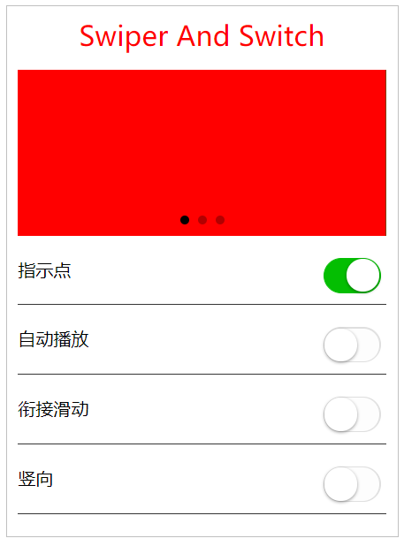

```html
<!--pages/4_5/4_5.wxml-->
<view class="box">
  <view class="title">Swiper And Switch</view>

  <swiper indicator-dots="{{indicatorDots}}" autoplay="{{autoplay}}" circular="{{circular}}" vertical="{{vertical}}" interval="{{interval}}" duration="{{duration}}">
    <block wx:for="{{background}}" wx:key="{{index}}">
      <swiper-item>
        <view class="{{item}}"></view>
      </swiper-item>
    </block>
  </swiper>

  <view class="waikuang">
    <text class="myLeft">指示点</text>
    <switch checked="{{indicatorDots}}" bindchange="changeIndicatorDots" />
  </view>

  <view class="waikuang">
    <text class="myLeft">自动播放</text>
    <switch checked="{{autoplay}}" bindchange="changeAutoplay" />
  </view>

  <view class="waikuang">
    <text class="myLeft">衔接滑动</text>
    <switch checked="{{circular}}" bindchange="changeCircular" />
  </view>

  <view class="waikuang">
    <text class="myLeft">竖向</text>
    <switch checked="{{vertical}}" bindchange="changeVertical" />
  </view>
</view>
```

```css
/* pages/4_5/4_5.wxss */
.bc-red {
  width: 100%;
  height: 150px;
  background-color: red;
}

.bc-green {
  width: 100%;
  height: 150px;
  background-color: green;
}

.bc-blue {
  width: 100%;
  height: 150px;
  background-color: blue;
}

.waikuang {
  display: flex;
  flex-direction: row;
  border-bottom: 1px solid #353535;
  margin: 10px 0px;
  padding: 10px 0px;
}

.myLeft {
  flex: 1;
}
```

```js
// pages/4_5/4_5.js
Page({
  data: {
    background: ["bc-red", "bc-green", "bc-blue"],
    indicatorDots: true,
    autoplay: false,
    circular: false,
    vertical: false,
    interval: 2000,
    duration: 500
  },

  changeIndicatorDots: function(e) {
    this.setData({
      indicatorDots: !this.data.indicatorDots
    })
  },

  changeAutoplay: function(e) {
    this.setData({
      autoplay: !this.data.autoplay
    })
  },

  changeCircular: function(e) {
    this.setData({
      circular: !this.data.circular
    })
  },

  changeVertical: function(e) {
    this.setData({
      vertical: !this.data.vertical
    })
  }
})
```

`swiper`组件：滑块视图容器组件，能够实现轮播图的效果。

| 属性名                 | 说明                                           |
| ---------------------- | ---------------------------------------------- |
| indicator-dots         | 是否显示面板指示点                             |
| indicator-color        | 指示点颜色                                     |
| indocator-avtive-color | 当前选中的指示点颜色                           |
| autoplay               | 是否自动切换                                   |
| current                | 当前所在滑块的index                            |
| current-item-id        | 当前所在滑块的item-id，不能与current被同时指定 |
| interval               | 自动切换时间间隔                               |
| duration               | 滑动动画时长                                   |
| circular               | 是否采用衔接滑动                               |
| vertival               | 滑动方向是否为纵向                             |
| bindchange             | current改变时会触发change事件                  |

`switch`组件：开关选择器组件，能够实现开关效果。

| 属性名     | 说明                           |
| ---------- | ------------------------------ |
| checked    | 是否选中                       |
| disabled   | 是否禁用                       |
| type       | 样式，有效值：switch, checkbox |
| bindchange | checked改变时触发change事件    |
| color      | switch的颜色                   |

<div STYLE="page-break-after: always;"></div>

### 4.6 个人信息填写

设计一个小程序，实现个人信息的录入与显示。个人信息包括姓名、性别、籍贯、出生日期、身高、体重等。输入完个人信息后，点击按钮，能够显示录入的个人信息。

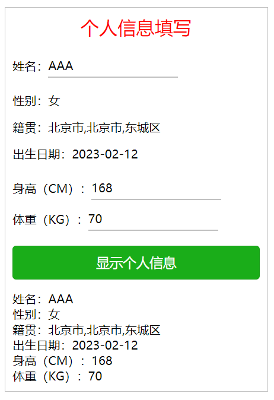

```html
<!--pages/4_6/4_6.wxml-->
<view class="box">
  <view class="title">个人信息填写</view>

  <view class="lineLayout">
    <view>姓名：</view>
    <input placeholder="请输入姓名" bindinput="nameInput" />
  </view>

  <picker bindchange="pickerSex" range="{{gender}}">
    <view>性别：{{sex}}</view>
  </picker>

  <picker mode="region" bindchange="pickerRegion">
    <view>籍贯：{{birthPlace}}</view>
  </picker>

  <picker mode="date" start="1800-01-01" end="2999-12-12" bindchange="pickerDate">
    <view>出生日期：{{birthDay}}</view>
  </picker>

  <view class="lineLayout">
    <view>身高（CM）：</view>
    <input type="number" placeholder="请输入身高" bindinput="heightInput" />
  </view>

  <view class="lineLayout">
    <view>体重（KG）：</view>
    <input type="digit" placeholder="请输入体重" bindinput="weightInput" />
  </view>

  <button type="primary" bindtap="showMessage">显示个人信息</button>

  <view hidden="{{flag}}">
    <view>姓名：{{person.name}}</view>
    <view>性别：{{person.sex}}</view>
    <view>籍贯：{{person.birthPlace}}</view>
    <view>出生日期：{{person.birthDay}}</view>
    <view>身高（CM）：{{person.height}}</view>
    <view>体重（KG）：{{person.weight}}</view>
  </view>
</view>
```

```css
/* pages/4_6/4_6.wxss */
.lineLayout {
  display: flex;
  flex-direction: row;
  justify-content: flex-start; /* 弹性盒子元素在主轴（横轴）方向上的对齐方式 */
  align-items: center; /* 定义flex子项在flex容器的当前行的侧轴（纵轴）方向上的对齐方式 */
}

input {
  height: 30px;
  border-bottom: 2px solid silver;
  margin: 10rpx 0;
}

picker, button {
  margin: 15px 0;
}
```

```js
// pages/4_6/4_6.js

function Person(name, sex, birthPlace, birthDay, height, weight) {
  this.name = name;
  this.sex = sex;
  this.birthPlace = birthPlace;
  this.birthDay = birthDay;
  this.height = height;
  this.weight = weight;
}

Page({
  data: {
    flag: true,
    gender: ["男", "女"]
  },

  nameInput: function(e) {
    this.name = e.detail.value
  },

  pickerSex: function(e) {
    this.sex = this.data.gender[e.detail.value];
    this.setData({
      sex: this.sex
    })
  },

  pickerRegion: function(e) {
    this.birthPlace = e.detail.value;
    this.setData({
      birthPlace: this.birthPlace
    })
  },

  pickerDate: function(e) {
    this.birthDay = e.detail.value;
    this.setData({
      birthDay: this.birthDay
    })
  },

  heightInput: function(e) {
    this.height = e.detail.value;
  },

  weightInput: function(e) {
    this.weight = e.detail.value;
  },

  showMessage: function(e) {
    var p = new Person(this.name, this.sex, this.birthPlace, this.birthDay, this.height, this.weight);
    this.setData({
      flag: false,
      person: p
    })
  }
})
```

`picker`组件：从屏幕底部弹起的滚动选择器，现支持五种类型的选择器，通过`mode`来区分，分别是：普通选择器、多列选择器、时间选择器、日期选择器和省市区选择器，默认的是普通选择器。

- 普通选择器（`mode=selector`）和多列选择器（`mode=multiSelector`）

| 属性名     | 类型                 | 说明                                                         |
| ---------- | -------------------- | ------------------------------------------------------------ |
| range      | Array / Object Array | 数据元素数组                                                 |
| range-key  | String               | 当range是一个Object Array时，通过range-key来指定Object中key的值作为选择器显示内容 |
| value      | Number               | value的值表示选择了range中的第几个（下标从0开始）元素        |
| bindchange | EventHandle          | value改变时触发change事件                                    |

- 时间选择器（`mode=time`）

| 属性名     | 类型        | 说明                                |
| ---------- | ----------- | ----------------------------------- |
| value      | String      | 表示选中的时间，字符串格式为"hh:mm" |
| start      | String      | 表示有效时间范围的开始              |
| end        | String      | 表示有效时间范围的结束              |
| bindchange | EventHandle | value改变时触发change事件           |

- 日期选择器（`mode=date`）

| 属性名      | 说明                               |
| ---------- | ---------------------------------- |
| value       | 表示选中的日期，格式为"YYYY-MM-DD" |
| start          | 表示有效日期范围的开始             |
| end           | 表示有效日期范围的结束             |
| fields         | 有效值year, month, day，表示选择器的粒度，默认值为day |
| bindchange | value改变时触发change事件          |

- 省市区选择器（`mode=region`）

| 属性名      | 说明                                                  |
| ----------- | ----------------------------------------------------- |
| value       | Array类型，表示选中的省市区，默认选中每一列的第一个值 |
| custom-item | 可为每一列的顶部添加一个自定义的项                    |
| bindchange  | value改变时触发change事件                             |

自定义构造函数：也是一个普通函数，创建方式也和普通函数一样，但构造函数习惯上首字母大写。

<div STYLE="page-break-after: always;"></div>

### 4.7 图片显示模式

设计一个小程序，演示不同模式下图片的显示效果。

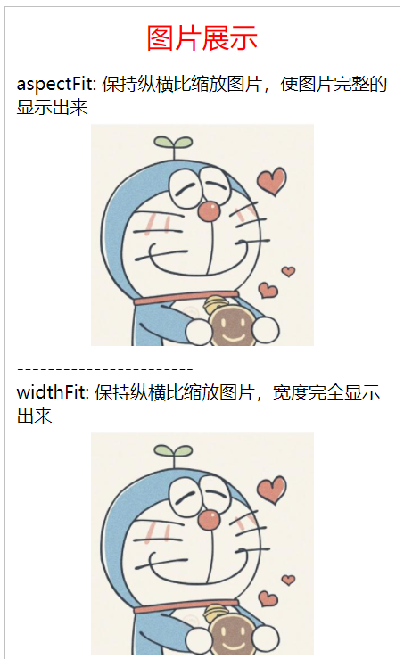

```html
<!--pages/4_7/4_7.wxml-->
<view class="box">
  <view class="title">图片展示</view>

  <view wx:for="{{imgArray}}">
    <view>{{item.text}}</view>
    <view class="imgLayout">
      <image src="{{src}}" mode="{{item.mode}}"/>
    </view>
    -----------------------
  </view>
</view>
```

```css
/* pages/4_7/4_7.wxss */
.imgLayout {
  text-align: center;
  margin: 5px 0;
}

image {
  width: 200px;
  height: 200px;
  background-color: #eee;
}
```

```js
// pages/4_7/4_7.js
Page({
  data: {
    src: "../../images/testImage.png",

    imgArray: [
      {
        mode: "aspectFit",
        text: "aspectFit: 保持纵横比缩放图片，使图片完整的显示出来"
      },
      {
        mode: "widthFit",
        text: "widthFit: 保持纵横比缩放图片，宽度完全显示出来"
      },
      {
        mode: "scaleToFill",
        text: "scaleToFill: 不保持纵横比缩放图片，使图片拉伸适应"
      },
      {
        mode: "aspectFill",
        text: "aspectFill: 不保持纵横比缩放图片，只保证图片的短边能完全显示出来"
      },
      {
        mode: "top",
        text: "top: 不缩放图片，只显示图片的顶部区域"
      },
      {
        mode: "bottom",
        text: "bottom: 不缩放图片，只显示图片的底部区域"
      },
      {
        mode: "center",
        text: "center: 不缩放图片，只显示图片的中间区域"
      },
      {
        mode: "left",
        text: "left: 不缩放图片，只显示图片的左边区域"
      },
      {
        mode: "right",
        text: "right: 不缩放图片，只显示图片的右边区域"
      },
      {
        mode: "top left",
        text: "top left: 不缩放图片，只显示图片的左上边区域"
      },
      {
        mode: "top right",
        text: "top right: 不缩放图片，只显示图片的右上边区域"
      },
      {
        mode: "bottom left",
        text: "bottom left: 不缩放图片，只显示图片的左下边区域"
      },
      {
        mode: "bottom right",
        text: "bottom right: 不缩放图片，只显示图片的右下边区域"
      }
    ]
  }
})
```

`image`组件：用于显示图片，支持JPG、PNG、SVG格式。

| 属性 | 默认值      | 说明           |
| ---- | ----------- | -------------- |
| src  |             | 图片的资源地址 |
| mode | scaleToFill | 图片的显示模式 |

`image`组件的显示模式提供了4种缩放模式和9种裁剪模式，利用`mode`属性进行设置。

| 值           | 说明                                                         |
| ------------ | ------------------------------------------------------------ |
| scaleToFill  | 不保持纵横比缩放图片，使图片完全拉伸至填满image元素          |
| aspectFit    | 保持纵横比缩放图片，使图片的长边能完全显示出来。可以完整地将图片显示出来 |
| aspectFill   | 不保持纵横比缩放图片，只保证图片的短边能完全显示出来。图片通常只在水平或垂直方向是完整的，另一个方向将会发生截取 |
| widthFix     | 宽度不变，高度自动变化，保持原图宽高比不变                   |
| top          | 不缩放图片，只显示图片的顶部区域                             |
| bottom       | 不缩放图片，只显示图片的底部区域                             |
| center       | 不缩放图片，只显示图片的中间区域                             |
| left         | 不缩放图片，只显示图片的左边区域                             |
| right        | 不缩放图片，只显示图片的右边区域                             |
| top left     | 不缩放图片，只显示图片的左上边区域                           |
| top right    | 不缩放图片，只显示图片的右上边区域                           |
| bottom left  | 不缩放图片，只显示图片的左下边区域                           |
| bottom right | 不缩放图片，只显示图片的右下边区域                           |

<div STYLE="page-break-after: always;"></div>

### 4.8 音频演示

设计一个小程序，演示音频的播放、暂停播放、设置当前播放时间和从头开始播放等效果。

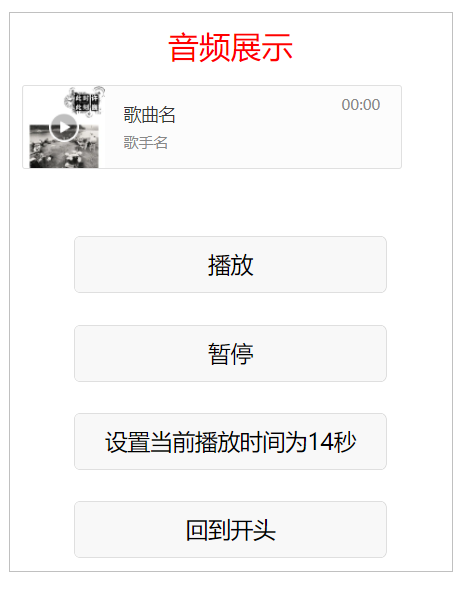

```html
<!--pages/4_8/4_8.wxml-->
<view class="box">
  <view class="title">音频展示</view>

  <audio id="myAudio" poster="{{poster}}" name="{{name}}" author="{{author}}" src="{{src}}" controls loop></audio>

  <view class="btnLayout">
    <button bindtap="audioPlay">播放</button>
    <button bindtap="audioPause">暂停</button>
    <button bindtap="audio14">设置当前播放时间为14秒</button>
    <button bindtap="audioStart">回到开头</button>
  </view>
</view>
```

```css
/* pages/4_8/4_8.wxss */
button {
  margin-top: 50rpx;
  width: 500rpx;
}

.btnLayout {
  margin-top: 50rpx;
  display: flex;
  flex-direction: column;
  align-items: center;  /* 沿交叉轴方向居中对齐 */
}
```

```js
// pages/4_8/4_8.js
Page({
  data: {
    poster: "http://y.gtimg.cn/music/photo_new/T002R300x300M000003rsKF44GyaSk.jpg?max_age=2592000",
    name: "歌曲名",
    author: "歌手名",
    src: "http://ws.stream.qqmusic.qq.com/M500001VfvsJ21xFqb.mp3?guid=ffffffff82def4af4b12b3cd9337d5e7&uin=346897220&vkey=6292F51E1E384E06DCBDC9AB7C49FD713D632D313AC4858BACB8DDD29067D3C601481D36E62053BF8DFEAF74C0A5CCFADD6471160CAF3E6A&fromtag=46"
    // src: "/audios/music.mp3",
  },

  

  onLoad: function(options) {
    this.audioCtx = wx.createAudioContext("myAudio");
  },

  audioPlay: function() {
    this.audioCtx.play();
  },

  audioPause: function() {
    this.audioCtx.pause();
  },

  audio14: function() {
    this.audioCtx.seek(14);
  },

  audioStart: function() {
    this.audioCtx.seek(0);
  }
})
```

<div STYLE="page-break-after: always;"></div>

### 4.9 视频演示

设计一个小程序，实现播放视频和发送随机变化颜色的弹幕等功能。

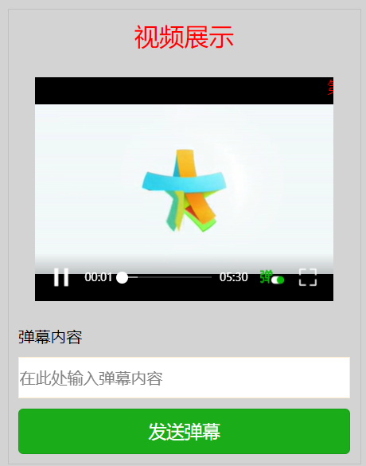

```html
<!--pages/4_9/4_9.wxml-->
<view class="box">
  <view class="title">视频展示</view>

  <view class="videoLayout">
    <video id="myVideo" src="http://wxsnsdy.tc.qq.com/105/20210/snsdyvideodownload?filekey=30280201010421301f0201690402534804102ca905ce620b1241b726bc41dcff44e00204012882540400&bizid=1023&hy=SH&fileparam=302c020101042530230204136ffd93020457e3c4ff02024ef202031e8d7f02030f42400204045a320a0201000400" danmu-list="{{danmuList}}" enable-danmu danmu-btn controls />
  </view>

  <view class="view">弹幕内容</view>
  <input bindblur="inputBlur" type="text" placeholder="在此处输入弹幕内容" />
  <button type="primary" bindtap="sendDanmu">发送弹幕</button>
</view>
```

```css
/* pages/4_9/4_9.wxss */
page {
  background-color: lightgray;
}

.videoLayout {
  margin: 50rpx 0;
  display: flex;
  flex-direction: column;
  align-items: center;
}

input {
  height: 80rpx;
  background-color: white;
  border: 1px solid blanchedalmond;
  margin: 10px 0;
}
```

```js
// pages/4_9/4_9.js

function getRandomColor() {
  let rgb = [];
  for(let i = 0; i < 3; i++) {
    // 产生0-255之间的16进制随机数
    let color = Math.floor(Math.random() * 256).toString(16);
    color = color.length == 1 ? '0' + color : color;
    rgb.push(color);
  }
  return "#" + rgb.join('')
}

Page({
  data: {
    danmuList: [
      {
        text: "第 1s 出现的弹幕",
        color: "#ff0000",
        time: 1
      },
      {
        text: "第 3s 出现的弹幕",
        color: "#ff00ff",
        time: 3
      }
    ]
  },

  onLoad: function(options) {
    this.videoCtx = wx.createVideoContext("myVideo");
  },

  inputBlur: function(e) {
    this.inputValue = e.detail.value;
  },

  sendDanmu: function() {
    this.videoCtx.sendDanmu({
      text: this.inputValue,
      color: getRandomColor()
    })
  }
})
```

<div STYLE="page-break-after: always;"></div>

### 4.10 考试场次选择

编写一个选择考试场次的小程序，考生首先利用邮箱和密码登录，输入自己的姓名和学号后选择考试场次。

考生登录时需要进行验证，如果某项输入为空，或者邮箱填写不正确，或者输入的密码和确认密码不一致，将给出错误提示并要求重新填写。

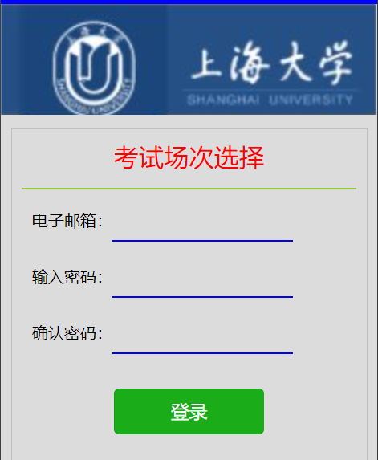

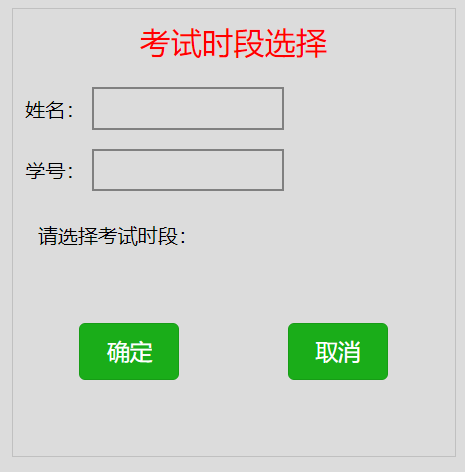

```html
<!--pages/4_10/4_10.wxml-->
<image src="/images/shouye.png" mode="scaleToFill"/>

<view class="box">
  <view class="title">考试场次选择</view>
  <view class="hr"></view>

  <form bindsubmit="formSubmit">
    <view class="lineLayout">
      <text>电子邮箱：</text>
      <input type="text" bindchange="inputemail" name="email" value="{{getEmail}}"/>
    </view>

    <view class="lineLayout">
      <text>输入密码：</text>
      <input type="password" name="password" value="{{getPwd}}"/>
    </view>

    <view class="lineLayout">
      <text>确认密码：</text>
      <input type="password" name="confirm" value="{{getPwdConfirm}}"/>
    </view>

    <button type="primary" form-type="submit">登录</button>

    <view>
      <view class="txt">{{showMsg01}}</view>
      <view class="txt">{{showMsg02}}</view>
    </view>
  </form>
</view>
```

```css
/* pages/4_10/4_10.wxss */

page {
  height: 100%;
  background: gainsboro;
}

image {
  width: 100%;
  height: 110px;
}

.hr {
  height: 2px;
  background-color: yellowgreen;
  margin: 10px 0;
}

.lineLayout {
  display: inline-block;
  margin: 10px;
}

text {
  float: left;
}

input {
  width: 180px;
  height: 30px;
  border-bottom: 2px solid blue;
  float: left;
}

input:hover {
  border-bottom: 2px solid chocolate;
}

button {
  width: 150px;
  margin: 20px auto;
}

.txt {
  color: red;
  background: yellow;
}
```

```js
// pages/4_10/4_10.js
Page({
  data: {
    getEmail: "",
    getPwd: "",
    getPwdConfirm: ""
  },

  formSubmit: function(e) {
    if(e.detail.value.email.length == 0 || e.detail.value.password.length == 0) {
      this.setData({
        showMsg01: "邮箱或密码不得为空！"
      })
    } else if(e.detail.value.password != e.detail.value.confirm) {
      this.setData({
        showMsg02: "两次输入密码不一致！",
        getPwd: "",
        getPwdConfirm: ""
      })
    } else {
      // 页面跳转
      wx.navigateTo({
        url: '../detail/detail',
      })
    }
  },

  inputemail: function(e) {
    var email = e.detail.value;
    var checkedNum = this.checkEmail(email);
  },

  checkEmail: function(email) {
    // 正则表达式
    let str = /^[a-zA-Z0-9_.-]+@[a-zA-Z0-9-]+(\.[a-zA-Z0-9-]+)*\.[a-zA-Z0-9]{2,6}$/;
    if(str.test(email)) {
      return true;
    } else {
      wx.showToast({
        title: '邮箱格式错误',
        icon: "loading"
      })
      
      this.setData({
        getEmail: ""
      })

      return false;
    }
  }
})
```

```html
<!--pages/detail/detail.wxml-->
<view class="box">
  <view class="title">考试时段选择</view>

  <form bindsubmit="formSubmit">
    <view class="flex">
      <text>姓名：</text>
      <input type="text" auto-focus name="name" value="{{name}}"/>
    </view>

    <view class="flex">
      <text>学号：</text>
      <input type="number" name="id" value="{{id}}"/>
    </view>

    <picker bindchange="chooseTime" value="{{index}}" range="{{array}}" name="time">
      请选择考试时段：{{array[index]}}
    </picker>

    <view class="btnLayout">
      <button type="primary" form-type="submit">确定</button>
      <button type="primary">取消</button>
    </view>
  </form>
</view>
```

```css
/* pages/detail/detail.wxss */

page {
  height: 100%;
  background: gainsboro;
}

.flex {
  display: flex;
  margin: 5px 0;
  justify-content: flex-start;
  align-items: center;
}

input {
  width: 150px;
  height: 30px;
  border: 2px solid gray;
  margin: 5px;
}

input:hover {
  border: 2px solid chocolate;
}

picker {
  margin: 10px;
  padding-top: 10px;
  padding-bottom: 10px;
}

.btnLayout {
  display: flex;
  flex-direction: row;
  justify-content: space-around;
  margin: 50px 0;
  width: 100%;
}

button {
  width: 80px;
}
```

```js
// pages/detail/detail.js
Page({
  data: {
    array: [
      "第一场15:00",
      "第二场16:20",
      "第三场17:40"
    ]
  },

  formSubmit: function(e) {
    var name = e.detail.value.name;
    var id = e.detail.value.id;
    var time = e.detail.value.time;

    wx.showModal({
      title: '确认信息',
      content: e.detail.value.name + "同学，你的学号是：" + id + "，你选择的场次是：" + this.data.array[time] + "，请确认信息！",
      // 回调函数
      success: function(res) {
        if(res.confirm) {
          wx.showModal({
            title: '信息确认',
            content: '你的考场信息已经确认！'
          })

          wx.navigateTo({
            url: '../index/index',
          })
        } else {
          console.log("用户点击取消")
        }
      }
    })
  },

  chooseTime: function(e) {
    var index = e.detail.value;
    this.setData({
      index: index
    })
  }
})
```

<div STYLE="page-break-after: always;"></div>

## 第5章 小程序API

### 5.1 变脸游戏

设计一个变脸小程序。小程序运行后首先出现一张脸谱画面，当点击这个画面时，脸谱会随机编程另一张画面。

当摇晃手机时，如果摇晃成功，会显示“摇一摇成功”的消息提示框，同时画面会随机变成了另一张脸谱，从而实现变脸。

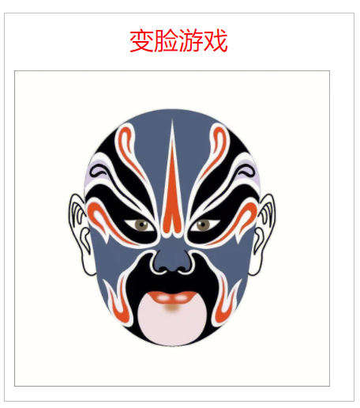

```html
<!--pages/5_1/5_1.wxml-->
<view class="box">
  <view class="title">变脸游戏</view>
  <view>
    <image src="{{imgArr[index]}}" bindtap="changeFace" mode="widthFix" />
  </view>
</view>
```

```js
// pages/5_1/5_1.js
function createRandomIndex() {
  return Math.floor(Math.random() * 10);
}

Page({
  data: {
    index: 0,
    imgArr: [
      "/images/01.jpg",
      "/images/02.jpg",
      "/images/03.jpg",
      "/images/04.jpg",
      "/images/05.jpg",
      "/images/06.jpg",
      "/images/07.jpg",
      "/images/08.jpg",
      "/images/09.jpg",
      "/images/10.jpg"
    ]
  },

  changeFace: function() {
    this.setData({
      index: createRandomIndex()
    })
  },

  onShow: function() {
    var that = this;
    wx.onAccelerometerChange(function(res) {
      // 设置加速度在某个坐标轴方向得到的数值
      if(res.x > 0.5 || res.y > 0.5 || res.z > 0.5) {
        wx.showToast({
          title: '摇一摇成功',
          icon: "success",
          duration: 2000
        })

        that.changeFace();
      }
    })
  }
})
```

<div STYLE="page-break-after: always;"></div>

### 5.2 阶乘计算器

设计一个求阶乘的小程序，在输入框中输入一个数值后摇晃手机，如果摇晃成功，将显示摇晃手机成功的消息提示框，并显示该数值的阶乘。

```html
<!--pages/5_2/5_2.wxml-->
<view class="box">
  <view class="title">阶乘计算器</view>
  <input type="number" bindinput="getInput" placeholder="请输入要求阶乘的数"/>
  <text>结果为：{{result}}</text>
</view>
```

```css
/* pages/5_2/5_2.wxss */
input {
  border-bottom: 3px solid blue;
  height: 40px;
  width: 200px;
  margin: 20px 0;
}
```

```js
// pages/5_2/5_2.js
Page({
  getInput: function(e) {
    this.inputVal = e.detail.value;
  },

  onShow: function() {
    var that = this;
    that.isShow = true;

    wx.onAccelerometerChange(function(e) {
      // 判断小程序界面是否显示
      if(!that.isShow) {
        return;
      }

      if(e.x > 0.5 || e.y > 0.5 || e.z > 0.5) {
        wx.showToast({
          title: '摇一摇成功',
          icon: "success",
          duration: 2000
        })

        var result = 1;
        for(var i = 1; i <= that.inputVal; i++) {
          result = result * i;
        }

        that.setData({
          result: result
        })
      }
    })
  },

  onHide: function() {
    this.isShow = false;
  }
})
```

<div STYLE="page-break-after: always;"></div>

### 5.3 基本绘图

设计一个小程序，实现基本绘图和设置图形样式功能，绘图包括：绘制点、线、圆、矩形、文字等；设置图形样式包括：设置线条的粗细、类型、端点样式、图形的渐变样式、阴影、透明度等。

```html
<!--pages/5_3/5_3.wxml-->
<view class="box">
  <view class="title">基本绘图</view>

  <view>
    <canvas canvas-id="myCanvas" />
  </view>

  <view class="btnLayout">
    <button type="primary" bindtap="clear">清除</button>
    <button type="primary" bindtap="drawDot">画点</button>
    <button type="primary" bindtap="drawCircle">画圆</button>
  </view>

  <view class="btnLayout">
    <button type="primary" bindtap="drawDash">画虚线</button>
    <button type="primary" bindtap="capAndJoin">端点交点</button>
    <button type="primary" bindtap="drawText">画字</button>
  </view>

  <view class="btnLayout">
    <button type="primary" bindtap="circularGrad">圆形渐变</button>
    <button type="primary" bindtap="shadowRect">阴影矩形</button>
    <button type="primary" bindtap="translucent">半透明</button>
  </view>
</view>
```

```css
/* pages/5_3/5_3.wxss */
canvas {
  width: 100%;
  height: 340px;
  background-color: cornflowerblue;
}

button {
  width: 100px;
}

.btnLayout {
  display: flex;
  flex-direction: row;
  margin: 10px;
  justify-content: space-around; /* 弹性项目沿主轴方向平均平布，两边留有一半的间隔空间 */
}
```

```js
// pages/5_3/5_3.js
var ctx = wx.createCanvasContext('myCanvas')

Page({
  clear: function () {
    ctx.draw(); // 刷新屏幕，显示绘制效果（无参数或参数为false时要先清除画布）
  },

  drawDot: function (e) {
    ctx.arc(200, 200, 10, 0, 2 * Math.PI);
    ctx.setFillStyle("black");
    ctx.fill(); // 对当前路径中的内容进行填充，默认的填充色为黑色
    ctx.draw();
  },

  drawCircle: function () {
    ctx.setFillStyle("black");
    ctx.arc(200, 200, 10, 0, 2 * Math.PI);
    ctx.fill();

    ctx.setStrokeStyle("red") // 设置描边颜色
    ctx.moveTo(300, 200); // 把路径移动到画布中的指定点，不创建线条
    ctx.arc(200, 200, 100, 0, 2 * Math.PI); // 创建以(200,200)为圆心，以100为半径的圆
    ctx.stroke(); // 画出当前路径的边框
    ctx.draw()
  },

  drawDash: function () {
    ctx.setStrokeStyle("red");
    ctx.setLineDash([20, 10]); // 线条的长度为20，线条与线条的间隔为10
    ctx.setLineWidth(10); // 设置宽度
    ctx.moveTo(50, 100); // 把路径移动到画布中的指定点
    ctx.lineTo(250, 100);
    ctx.lineTo(150, 300);
    ctx.lineTo(50, 100);

    ctx.stroke();
    ctx.draw();
    ctx.setLineDash([0, 0]); // 恢复默认线条样式
    ctx.setLineWidth(1); // 恢复默认线条宽度
  },

  capAndJoin: function () {
    ctx.setStrokeStyle("red");
    ctx.setLineWidth(20);
    ctx.setLineCap("round"); // 设置线条端点样式
    ctx.setLineJoin("miter"); // 设置线条连接样式
    ctx.moveTo(50, 50);
    ctx.lineTo(250, 50);
    ctx.lineTo(50, 250);
    ctx.lineTo(250, 250);
    ctx.stroke();
    ctx.draw();
    ctx.setLineWidth(1);
    ctx.setLineCap("butt"); // 设置线条端点样式
    ctx.setLineJoin("mitter");
  },

  drawText: function() {
    ctx.setFillStyle("red");
    ctx.setFontSize(40);
    ctx.setTextBaseline("bottom");  // 设置文本基线
    ctx.fillText("北方工业大学", 80, 80);

    ctx.setFillStyle("yellow");
    ctx.setTextBaseline("top");
    ctx.fillText("北方工业大学", 80, 80);

    ctx.setFillStyle("black");
    ctx.rotate(30 * Math.PI / 180);   // 旋转字体
    ctx.fillText("北方工业大学", 150, 80);

    ctx.draw();
  },

  circularGrad: function() {
    var grd = ctx.createCircularGradient(175, 175, 125);  // 创建以点(175,175)为圆心，以125为半径的圆形渐变
    grd.addColorStop(0, "purple");  // 添加渐变起点
    grd.addColorStop(1, "white");   // 添加渐变终点
    ctx.setFillStyle(grd);      // 设置圆形渐变填充样式
    ctx.fillRect(50, 50, 250, 250); // 创建起点(50,50)，宽度和高度都为250的填充矩形
    ctx.draw();
  },

  shadowRect: function() {
    ctx.setFillStyle("orange");
    ctx.setShadow(20, 20, 50, "yellow");  // 设置阴影
    ctx.fillRect(50, 50, 250, 250);
    ctx.draw();
  },

  translucent: function() {
    ctx.setFillStyle("red");
    ctx.setGlobalAlpha(0.2);  // 设置全局透明度
    ctx.fillRect(50, 50, 250, 250);
    ctx.draw();
    ctx.setGlobalAlpha(1);    // 恢复以前设置
  }
})
```

<div STYLE="page-break-after: always;"></div>

### 5.4 参数绘图

参数化绘图是指根据用户输入的数据作为图形参数绘制图形，从而实现交互式绘图。设计一个小程序，通过输入圆心坐标和半径绘制圆（保留以前绘制的图形）。

```html
<!--pages/5_4/5_4.wxml-->
<view class="box">
  <view class="title">参数绘图</view>

  <view class="style01">
    <canvas canvas-id="myCanvas"/>
  </view>

  <view>
    <form bindsubmit="drawCircle" bindreset="clear">
      <input name="x" type="number" placeholder="请输入圆心x坐标"/>
      <input name="y" type="number" placeholder="请输入圆心y坐标"/>
      <input name="radius" type="number" placeholder="请输入圆的半径"/>
      <view class="style02">
        <button type="primary" form-type="submit">画圆</button>
        <button type="primary" form-type="reset">清空</button>
      </view>
    </form>
  </view>
</view>
```

```css
/* pages/5_4/5_4.wxss */
.style01 {
  width: 100%;
}

canvas {
  border: 1px solid springgreen;
  width: 100%;
  height: 250px;
  margin-bottom: 20px;
}

input {
  margin-bottom: 20px;
  border-bottom: 1px solid rebeccapurple;
}

.style02 {
  display: flex;
  flex-direction: row;
  justify-content: center;
}
```

```js
// pages/5_4/5_4.js
Page({
  onLoad: function() {
    this.ctx = wx.createCanvasContext('myCanvas', this);
  },

  drawCircle: function(e) {
    var x = e.detail.value.x;
    var y = e.detail.value.y;
    var radius = e.detail.value.radius;

    this.ctx.arc(x, y, radius, 0, 2*Math.PI);
    this.ctx.stroke();  // 画出当前路径的边框
    this.ctx.draw(true);
  },

  clear: function() {
    this.ctx.draw();
  }
})
```

<div STYLE="page-break-after: always;"></div>

### 5.5 改变图形

设计小程序，实现对图形的绘制、放大、移动和旋转等功能。

```html
<!--pages/5_5/5_5.wxml-->
<view class="box">
  <view class="title">变形</view>

  <view class="style01">
    <canvas canvas-id="myCanvas"/>
  </view>

  <view class="style02">
    <button type="primary" bindtap="drawRect">绘图</button>
    <button type="primary" bindtap="scale">放大</button>
    <button type="primary" bindtap="translate">移动</button>
    <button type="primary" bindtap="rotate">旋转</button>
  </view>
</view>
```

```css
/* pages/5_5/5_5.wxss */
.style01 {
  width: 100%;
}

.style02 {
  display: flex;
  flex-direction: row;
  justify-content: space-between;
}

canvas {
  border: 1px solid springgreen;
  width: 100%;
  height: 200px;
}

button {
  width: 23%;
  margin: 10px 0px;
}
```

```js
// pages/5_5/5_5.js
Page({
  onReady: function() {
    this.ctx = wx.createCanvasContext('myCanvas', this);
  },

  drawRect: function() {
    var ctx = this.ctx;
    ctx.rect(0, 0, 50, 50);
    ctx.stroke();
    ctx.draw(true); // 参数为true表示保留以前画布图形
  },

  scale: function() {
    this.ctx.scale(2, 2); // 缩放图形
    this.drawRect();
  },

  translate: function() {
    this.ctx.translate(20, 20); // 移动图形
    this.drawRect();
  },

  rotate: function() {
    this.ctx.rotate(30 * Math.PI / 180);
    this.drawRect();
  }
})
```

<div STYLE="page-break-after: always;"></div>

### 5.6 绘制正弦曲线

编写一个小程序，实现正弦曲线的绘制。

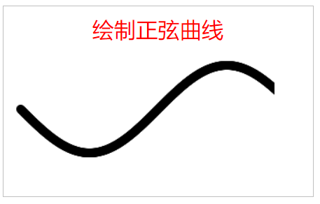

```html
<!--pages/5_6/5_6.wxml-->
<view class="box">
  <view class="title">绘制正弦曲线</view>

  <view>
    <canvas canvas-id="myCanvas"/>
  </view>
</view>
```

```js
// pages/5_6/5_6.js
var ctx = wx.createCanvasContext('myCanvas');
Page({
  onLoad: function(options) {
    this.drawSinX();
  },

  // 绘制实心圆点
  drawDot: function(x, y) {
    ctx.arc(x, y, 5, 0, 2*Math.PI);
    ctx.setFillStyle("black");
    ctx.fill();
    ctx.draw(true);
  },

  drawSinX: function() {
    for(var x = 0; x < 2 * Math.PI; x += Math.PI / 180) {
      var y = Math.sin(x);
      // 放大x和y的比例
      this.drawDot(10 + 50*x, 60 + 50*y);
    }
  }
})
```

<div STYLE="page-break-after: always;"></div>

### 5.7 自由绘图

